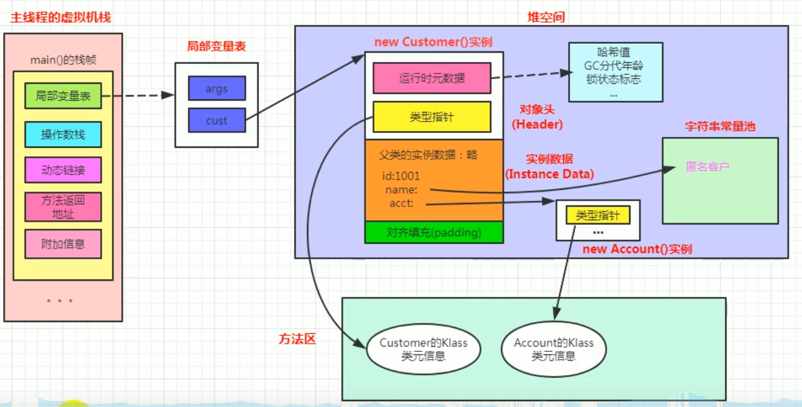
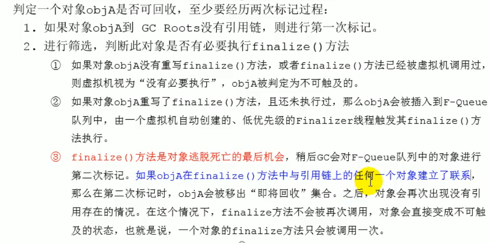
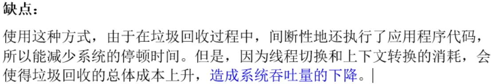

# jvm内存结构

## 运行时方法区

### 运行时方法区对象内存分布图

## 执行引擎

### 执行引擎作用

jvm将字节码装载在其内部，但是操作系统不能直接识别字节码，这就需要**执行引擎将字节码指令解释/编译为对应平台上的本地机器指令——即将高级语言翻译为机器语言**

### 执行引擎结构

主要来说就是jvm执行引擎既有解释器(interpreter)也有编译器(jit compiler)

什么是字节码？

### 解释器和JIT

当虚拟机启动时候，**解释器可以首先发挥作用**，不用等待jit编译器全部编译完成再执行，这样可以省去许多不必要的编译时间。并且随着程序运行时间的推移，jit编译器逐渐发挥作用，根据热点探测功能，**将有价值的字节码编译为本地机器指令（热点代码），并缓存**，来得到更高的程序执行效率

  

### JIT

热点代码会触发JIT  （方法调用计数器和回边计数器）

热点判断

方法调用计数器

回边计数器

 

热度衰减

假如只数绝对次数，那么只要执行时间够久，所有代码都能成为热点代码，如何改善

c1 c2编译器

总结：

- 一般来讲，jit编译出来的机器码性能比解释器高
- C2编译器启动时长比C1编译器慢，系统稳定执行后，C2编译器速度远远快于C1编译器

## String table

s1: "a"放入常量池

s2:"b"放入常量池

s3:"ab"放入常量池  （编译优化，直接在编译阶段把”a“+"b"编译为"ab"）

s4: new Stringbuffer,用append方法拼接”a“ ”b“，最后toString，相当于重新new了一个String对象，放在堆中

s5:常量池已经有"ab" 直接引用

s6:尝试把s4（”ab“）放入常量池，常量池中已有"ab"，所以放入失败，直接返回常量池中对象给s6

s3==s4? :  s3是常量池中“ab”，s4是new的string对象，结果为false

s3==s5? : s3是常量池中“ab”，s5企图把"ab"放入常量池，但常量池已有，直接引用常量池中对象，所以结果为true

s3==s6? :  s3是常量池中“ab”;尝试试把s4（”ab“）放入常量池，常量池中已有"ab"，所以放入失败，直接返回常量池中对象给s6  ;所以为true

x1==x2?: 当前的话是new个x2，然后成功把x2放入常量池，然后x1直接引用常量池对象，结果为true

​				如果x2.intern();和String x1="cd"；交换位置  ，那么在String x1="cd"时把cd放入常量池，而x2.intern();由于常量池中已有cd，不会成功把x2放入常量池，所以x1==x2为false；

**jdk1.6和jdk1.8的intern的区别：**（String s6=s4.intern() 区别在于若常量池中没有，1.8会在常量池中创建一个引用，直接指向s4，而1.6是复制一份字面量放入池中）

jdk1.6：

jdk1.8：

**总结：** 

1.直接用String s=”xxx“ 是在常量池中放”xxx“ s引用指向这个池子；如果下次还有同样的”xxx“，那么不会重复入池；如果是String x=new String（”xxx“），那么是在堆中放一个新对象，和池子无关；string.intern（）尝试把string内容放入池子（jdk1.6和1.8有区别）；

2.string x=”xxx“+x1 其实是新建了一个stringbuilder然后append，最后tostring（tostring最后调用了一个newstring,**注意append（）等最后调用tostring的方法，不会再常量池中放入字符**） 那么显然这个x也是一个堆中新对象

3.**字符串拼接不一定都用stringbuilder，如果拼接符号左右两边都是字符串常量或者常量引用，则仍然使用编译器优化 即非stringBuilder  **

4.节省空间，多用字面量赋值，少用new string，用newstring的话尽量用intern ()

## 其他知识

### 机器码 指令 汇编

计算机只认识机器语言，机器语言可读性实在太差，所以发明了指令，把机器码中特定的0和1序列简化为对应指令（比如mov，inc）

指令可读性还是太差，所以发明了汇编语言

最后为了让人编程更方便 发明了高级语言

java中特有的字节码，执行引擎就是转译为可执行的指令

# 垃圾回收

## 垃圾标记算法

当一个对象已经不再被任何的存活对象继续引用时，就宣判为死亡

判断对象存活一般有两种方式：**引用计数算法（java里不用！！）**和**可达性算法**

### 引用计数算法

java没有选择引用计数算法，因为他无法处理循环引用情况

### 可达性分析算法

### finalization机制

对象的三种可能状态：

## 垃圾清除算法

### 标记清除算法

### 复制算法

### 标记压缩算法

### 上面三种算法对比

### 分代收集算法

  ### 增量收集算法

### 分区算法

## 垃圾回收相关概念

### System.gc()

### 内存溢出OOM

### 内存泄漏

### Stop-the-world

### 垃圾回收的并行与并发

### 安全点和安全区

安全点：

安全区：

