# MySQL索引

```markdown
# 1.什么是索引
- 官方定义: 一种帮助mysql提高查询效率的数据结构
- 索引的优点:
		1、大大加快数据查询速度
- 索引的缺点:
		1、维护索引需要耗费数据库资源
		2、索引需要占用磁盘空间
		3、当对表的数据进行增删改的时候，因为要维护索引，速度会受到影响

# 2.索引分类
- a.主键索引
		设定为主键后数据库会自动建立索引，innodb为聚簇索引

- b.单值索引
		即一个索引只包含单个列，一个表可以有多个单列索引 

- c.唯一索引   
		索引列的值必须唯一，但允许有空值

- d.复合索引
		即一个索引包含多个列

- e.Full Text 全文索引 (My5.7版本之前 只能由于MYISAM引擎)
		全文索引类型为FULLTEXT，在定义索引的列上支持值的全文查找，允许在这些索引列中插入重复值和空值。全文索引可以在CHAR、VARCHAR、			TEXT类型列上创建。MYSQL只有MYISAM存储引擎支持全文索引

# 3.索引的基本操作
```

```sql
1.主键索引 自动创建

--建表 主键自动创建主键索引
create table t_user(id varchar(20) primary key,name varchar(20));
--查看索引
show index from t_user;
```

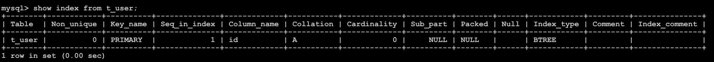

```sql
2.单列索引(普通索引|单值索引)
--建表时创建
create table t_user(id varchar(20) primary key,name varchar(20),key(name));  
	'注意:随表一起建立的索引索引名同列名一致'
	  
--建表后创建
create index nameindex on t_user(name);

--删除索引
drop index 索引名 on 表名
```

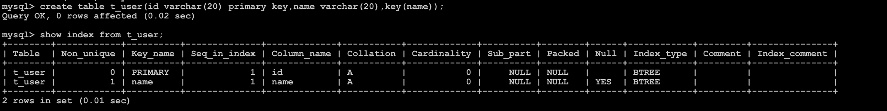

```sql
3.唯一索引
--建表时创建
 create table t_user(id varchar(20) primary key,name varchar(20),unique(name));
 
--建表后创建
	create unique index nameindex on t_user(name);
```


```sql
4.复合索引
---建表时创建
 create table t_user(id varchar(20) primary key,name varchar(20),age int,key(name,age));
 
--建表后创建
 create index nameageindex on t_user(name,age);
```

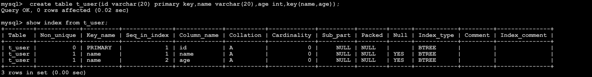

```markdown
# 4.索引的底层原理
```

```sql
1.思考
---建表
create table t_emp(id int primary key,name varchar(20),age int);

--插入数据
insert into t_emp values(5,'d',22);
insert into t_emp values(6,'d',22);
insert into t_emp values(7,'e',21);
insert into t_emp values(1,'a',23);
insert into t_emp values(2,'b',26);
insert into t_emp values(3,'c',27);
insert into t_emp values(4,'a',32);
insert into t_emp values(8,'f',53);
insert into t_emp values(9,'v',13);

--查询
select * from t_emp;
```

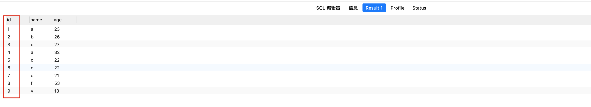

```markdown
# 5.为什么上面数据明明没有按顺序插入,为什么查询时却是有顺序呢?
- 原因是:mysql底层为主键自动创建索引,一定创建索引会进行排序
- 也就是mysql底层真正存储是这样的
- 为什么要排序呢?因为排序之后在查询就相对比较快了 如查询 id=3的我只需要按照顺序找到3就行啦(如果没有排序大海捞针,全靠运气😸!)
```

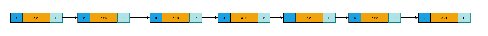

```markdown
# 6.为了进一步提高效率mysql索引又进行了优化
-  就是基于页的形式进行管理索引
-  如 查询id=4的 直接先比较页 先去页目录中找,再去 数据目录中找
```


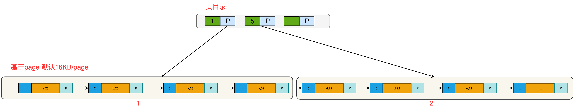

```markdown
# 7.上面这种索引结构称之为B+树数据结构,那么什么是B+树呢?
- 参考资料: https://www.cnblogs.com/lianzhilei/p/11250589.html
```


B+Tree是在B-Tree基础上的一种优化，使其更适合实现外存储索引结构，InnoDB存储引擎就是用B+Tree实现其索引结构。

从上一节中的B-Tree结构图中可以看到每个节点中不仅包含数据的key值，还有data值。而每一个页的存储空间是有限的，如果data数据较大时将会导致每个节点（即一个页）能存储的key的数量很小，当存储的数据量很大时同样会导致B-Tree的深度较大，增大查询时的磁盘I/O次数，进而影响查询效率。在B+Tree中，所有数据记录节点都是按照键值大小顺序存放在同一层的叶子节点上，而非叶子节点上只存储key值信息，这样可以大大加大每个节点存储的key值数量，降低B+Tree的高度。

B+Tree相对于B-Tree有几点不同：

1. 非叶子节点只存储键值信息。
2. 所有叶子节点之间都有一个链指针。
3. 数据记录都存放在叶子节点中。

- InnoDB存储引擎中页的大小为16KB，一般表的主键类型为INT（占用4个字节）或BIGINT（占用8个字节），指针类型也一般为4或8个字节，也就是说一个页（B+Tree中的一个节点）中大概存储16KB/(8B+8B)=1K个键值（因为是估值，为方便计算，这里的K取值为〖10〗^3）。也就是说一个深度为3的B+Tree索引可以维护10^3 * 10^3 * 10^3 = 10亿 条记录。 

- 实际情况中每个节点可能不能填充满，因此在数据库中，B+Tree的高度一般都在2~4层。[mysql](http://lib.csdn.net/base/mysql)的InnoDB存储引擎在设计时是将根节点常驻内存的，也就是说查找某一键值的行记录时最多只需要1~3次磁盘I/O操作。

```markdown
# 8.聚簇索引和非聚簇索引
- 聚簇索引： 将数据存储与索引放到了一块，索引结构的叶子节点保存了行数据
- 非聚簇索引：将数据与索引分开存储，索引结构的叶子节点指向了数据对应的位置
```

`注意`:**在innodb中，在聚簇索引之上创建的索引称之为辅助索引，非聚簇索引都是辅助索引，像复合索引、前缀索引、唯一索引。辅助索引叶子节点存储的不再是行的物理位置，而是主键值，辅助索引访问数据总是需要二次查找**。

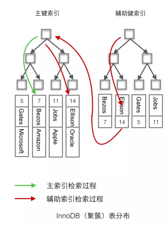

1. InnoDB中

- InnoDB使用的是聚簇索引，将主键组织到一棵B+树中，而行数据就储存在叶子节点上，若使用"where id = 14"这样的条件查找主键，则按照B+树的检索算法即可查找到对应的叶节点，之后获得行数据。

- 若对Name列进行条件搜索，则需要两个步骤：第一步在辅助索引B+树中检索Name，到达其叶子节点获取对应的主键。第二步使用主键在主索引B+树种再执行一次B+树检索操作，最终到达叶子节点即可获取整行数据。（重点在于通过其他键需要建立辅助索引）
- **聚簇索引默认是主键**，如果表中没有定义主键，InnoDB 会选择一个**唯一且非空的索引**代替。如果没有这样的索引，InnoDB 会**隐式定义一个主键（类似oracle中的RowId）**来作为聚簇索引。如果已经设置了主键为聚簇索引又希望再单独设置聚簇索引，必须先删除主键，然后添加我们想要的聚簇索引，最后恢复设置主键即可。

2. MYISAM

- MyISAM使用的是非聚簇索引，**非聚簇索引的两棵B+树看上去没什么不同**，节点的结构完全一致只是存储的内容不同而已，主键索引B+树的节点存储了主键，辅助键索引B+树存储了辅助键。表数据存储在独立的地方，这两颗B+树的叶子节点都使用一个地址指向真正的表数据，对于表数据来说，这两个键没有任何差别。由于**索引树是独立的，通过辅助键检索无需访问主键的索引树**。


```markdown
# 9.使用聚簇索引的优势
- 问题: 每次使用辅助索引检索都要经过两次B+树查找，看上去聚簇索引的效率明显要低于非聚簇索引，这不是多此一举吗？聚簇索引的优势在哪？
	
- 1.由于行数据和聚簇索引的叶子节点存储在一起，同一页中会有多条行数据，访问同一数据页不同行记录时，已经把页加载到了Buffer中（缓存器），再次访问时，会在内存中完成访问，不必访问磁盘。这样主键和行数据是一起被载入内存的，找到叶子节点就可以立刻将行数据返回了，如果按照主键Id来组织数据，获得数据更快。

- 2.辅助索引的叶子节点，存储主键值，而不是数据的存放地址。好处是当行数据放生变化时，索引树的节点也需要分裂变化；或者是我们需要查找的数据，在上一次IO读写的缓存中没有，需要发生一次新的IO操作时，可以避免对辅助索引的维护工作，只需要维护聚簇索引树就好了。另一个好处是，因为辅助索引存放的是主键值，减少了辅助索引占用的存储空间大小。
```

 ```markdown
# 10.聚簇索引需要注意什么?
- 当使用主键为聚簇索引时，主键最好不要使用uuid，因为uuid的值太过离散，不适合排序且可能出线新增加记录的uuid，会插入在索引树中间的位置，导致索引树调整复杂度变大，消耗更多的时间和资源。
- 建议使用int类型的自增，方便排序并且默认会在索引树的末尾增加主键值，对索引树的结构影响最小。而且，主键值占用的存储空间越大，辅助索引中保存的主键值也会跟着变大，占用存储空间，也会影响到IO操作读取到的数据量。

# 11. 为什么主键通常建议使用自增id
- 聚簇索引的数据的物理存放顺序与索引顺序是一致的，即：只要索引是相邻的，那么对应的数据一定也是相邻地存放在磁盘上的。如果主键不是自增id，那么可以想象，它会干些什么，不断地调整数据的物理地址、分页，当然也有其他一些措施来减少这些操作，但却无法彻底避免。但，如果是自增的，那就简单了，它只需要一页一页地写，索引结构相对紧凑，磁盘碎片少，效率也高。
 ```

```markdown
# 12. 什么情况下无法利用索引呢?
- 1. 查询语句中使用LIKE关键字
			在查询语句中使用 LIKE 关键字进行查询时，如果匹配字符串的第一个字符为“%”，索引不会被使用。如果“%”不是在第一个位置，索引就会被使用。

- 2.查询语句中使用多列索引
			多列索引是在表的多个字段上创建一个索引，只有查询条件中使用了这些字段中的第一个字段，索引才会被使用。


- 3.查询语句中使用OR关键字
			查询语句只有OR关键字时，如果OR前后的两个条件的列都是索引，那么查询中将使用索引。如果OR前后有一个条件的列不是索引，那么查询中将不使用索引。

```

----


# 事务

一系列的操作 要么全部成功 要么全部失败

## 事物的四大特征

**原子性**：要么都成功要么都失败

**一致性**：有两个概念一致性，一种是数据库本身的约束，比如事务前有个非空主键A，那事务后还是有那个非空主键A；还有一个是人为规定的，比如A有500，B有500，难么总金额是1000；然后事务中A给B转账200，那么事务结束后，A有300，B有700，总金额还是1000，和之前保持一致，这种一致性一般是人为规定的，一般在代码里人为实现

**隔离性**：并发事务之间互不影响

**持久性**：事务一旦提交，那么数据就永久地更改了

## 事务的隔离级别

**READ-UNCOMMITTED**：读未提交，最低隔离级别、事务未提交前，就可被其他事务读取（会出现幻读、脏读、不可重复读）。

**READ-COMMITTED**：读已提交，一个事务提交后才能被其他事务读取到（会造成幻读、不可重复读）。

**REPEATABLE-READ**：可重复读，mysql 默认级别，保证多次读取同一个数据时，其值都和事务开始时候的内容是一致，禁止读取到别的事务未提交的数据（会造成幻读）。 （Innodb的事物隔离级别是可重复读，但是解决了幻读问题，因为他用了间隙锁和临键锁）

**SERIALIZABLE**：序列化，代价最高最可靠的隔离级别，该隔离级别能防止脏读、不可重复读、幻读。

- 脏读：读到了别的事物未提交的数据，倘若那个事务回滚，则出现数据不一致（和不可重复读的不同点的重点在于 另一个事务有没有提交）

- 不可重复读：读一次得到一个数据，其他事务修改或删除了了该数据并提交，再读一次，读到了不一样的数据

- 幻读：两次count之间有个事物插入（删除不是）除了数据，造成两次count不同 （和不可重复读的区别重点在于 是插入还是修改还是删除）

  

  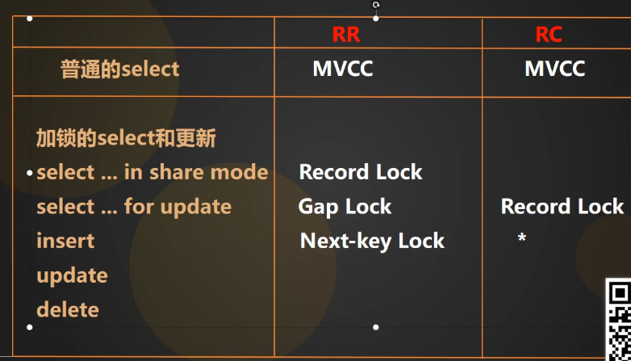

  

  ## RR和RC的MVCC的区别

  RR和RC的MVCC的区别在于（为什么RR可以解决不可重复读问题？）： mvcc的实现是每个行都有一个隐藏的列记录最近操作的事务号，一个隐藏列代表回滚指针。每操作一次会记录数据和事务号，并用回滚指针串起来（版本链）。

  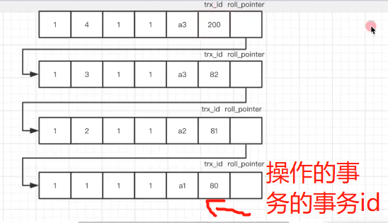

  

  在事务中select的时候，会生成一个快照（一个记录所有活跃的 即还未提交的事务的事务号的数组）然后去之前串起来的数据链里一条一条比较，假如某条数据的事务号不在数组中，则代表这个操作是已提交的事务做的，可以读取他的数据。而可重复读和读已提交的区别在于 读已提交每次select都生成一个新的快照；而可重复读只在第一次select生成快照，这样一来，在可重复读事务中，感知不到别的事务的提交，每次都只能读到一开始的数据，也就保证了每次select的数据的一致性。

  - 一言蔽之：RR和RC的MVCC机制区别在于，RR的只在第一次select产生快照，而RC每次select都能产生新快照。所以RR事务看不到别的事物的提交，也就保证了它每次读到的数据都是第一次select的数据。

## Myisam 和 InnoDB 的区别

- **是否支持行级锁** : MyISAM 只有表级锁 (table-level locking)，而 InnoDB 支持行级锁(row-level locking) 和表级锁, 默认为行级锁，适合高并发操作。
- **是否支持外键**： MyISAM 不支持，而 InnoDB 支持
- **是否支持事务**：MyISAM 不支持，而 InnoDB 支持
- **缓存**：MyISAM 只缓存索引，InnoDB 缓存索引和真实数据，所以对内存要求高
- **崩溃恢复**：MyISAM 崩溃后发生损坏的概率比 InnoDB 高很多，而且恢复的速度也更慢。


# 锁

## 各种锁的区别

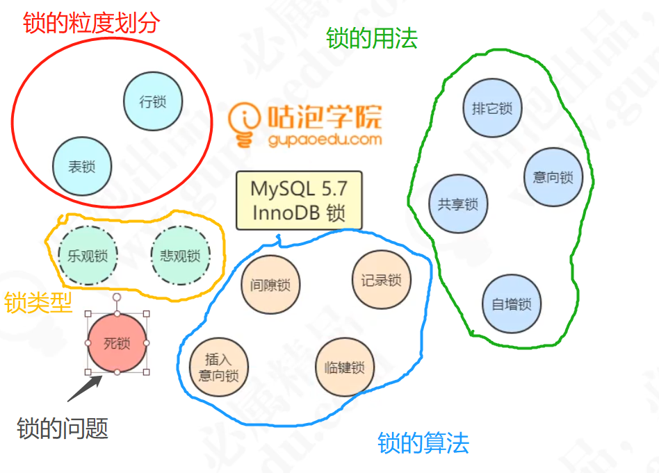

## 按粒读划分——行锁和表锁

行锁锁行，表锁锁表。

表锁对比行锁 锁定粒度大，加锁效率高，冲突概率高，并发性能低

## 行锁有记录锁 间隙锁 临键锁

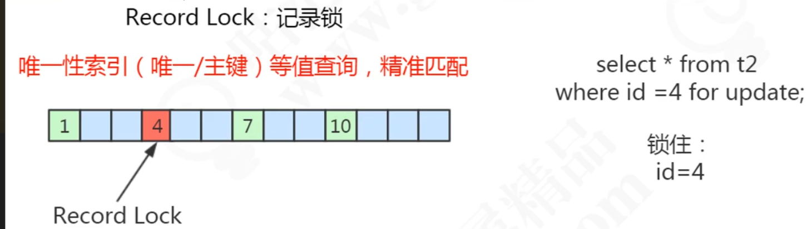

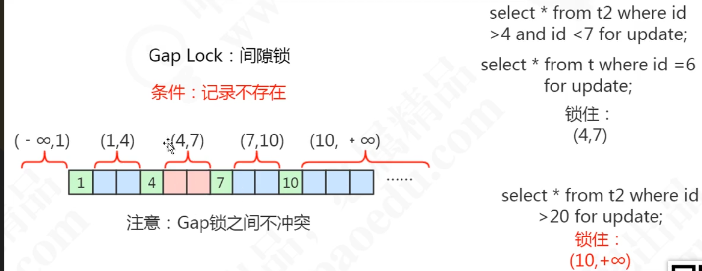

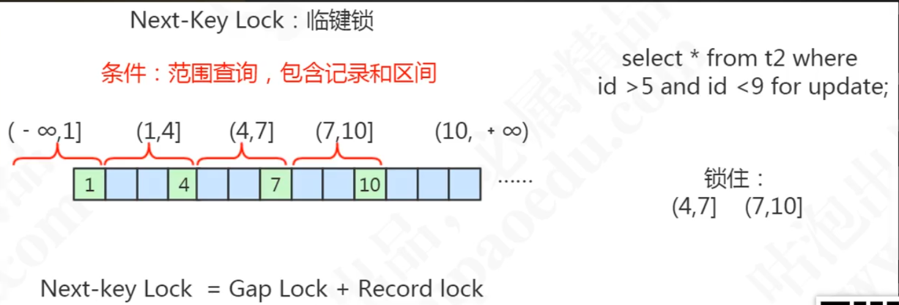

- innodb的可重复读级别可以解决幻读的原因就是有间隙锁和临键锁（这两种锁就是针对insert操作的）它把这些范围锁住了，也就不能在这些范围内insert新数据了，自然而然也不会再发生幻读

## 共享锁（读锁）和排他锁（写锁）


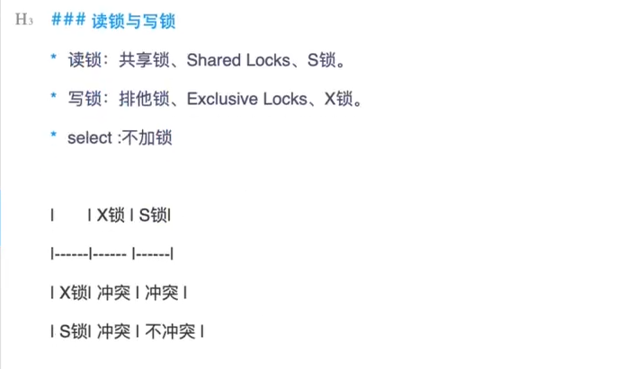

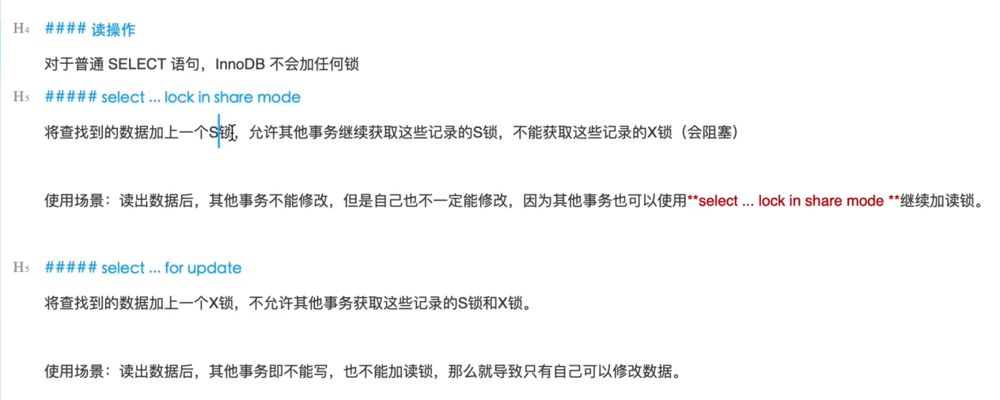

## 表锁有意向共享锁和意向排他锁

表锁 有意向共享锁和意向排他锁 （表锁要锁定表内所有行，所以加表锁的时候不能有行锁。因此在加行锁时候，数据库会自动给表加一个意向锁，表述表内有行被锁定，这样加表锁的时候，不用再一行一行扫描有没有行锁）

## 锁的本质锁的是索引

Read Commit

1.1 id为主键索引

InnerDB当中采用的是聚集索引，B+树中叶子节点存储的就是索引数据和对应的行数据，如果当前id是主键索引，那么可以确定根据索引确定具体的某个行，在这个行上面添加排它锁即(X锁)

1.2id为唯一索引

如果当前id为唯一索引，name为主键索引，在进行索引查找时需要两个步骤，第一步，查询到索引id对应的主键，第二步，根据主键查询到数据库信息，那么这个加锁过程就需要在第一步锁定的数据和第二步锁定的数据分别加上排它锁。

1.3 id为普通索引(非唯一索引)

根据InnerDB存储引擎的实现规则，同样在查询时，需要先找到id对应的主键，加锁，然后找到主键对应的行数据，再次加锁，不同的是，由于id非唯一索引，那么这两步加锁的数据可能不止一行，有可能是多行。

1.4 id 非索引

如果id不是索引，那么这是时候就需要进行全表扫描，InnerDB引擎的现实方式就是将整个表加锁，**当然MySQL在实现上也有一定的优化，在全表扫描后，对于不满足条件的，会释放掉锁，只对满足条件的数据进行加锁**(虽然行锁表锁但是由于mysql优化，只有范围内的数据会加锁)。


2.Repeatable Read

2.1 id为主键索引

如果是id主键，并且事务是RR级别，同1、1加锁方式

2.2 id 为唯一索引

加锁方式同1、2

2.3 id 为普通索引(非唯一索引)

在RR级别下，同一个事务内，不管什么时候读，读取到的数据都是一致的，这是RR事务和Read Commit事务的本质区别，为了实现RR事务上的隔离，MySQL会在对应行上面加X锁，同时在对应行直接加Gap锁(即间隔锁)

当其他事务尝试去插入一条数据时，[id,name]=[10,c] 根据id = 10，会先考虑在当前6和10之间插入，发现6和10之间加入了Gap锁，插入失败，接着尝试往10和10之间插入，发现也是有Gap锁，插入失败。最终发现[10,c]这条数据无法插入，这样就保证了RR级别下不能幻读。所以总结起来就是，对于非唯一索引，会根据查询条件，将查询到的数据行加上排他锁，同时在行之间加上Gap锁，根据聚集索引查询到对应的数据，对行数据再次加上排他锁，行锁。

2.4 id无索引

如果id没有索引，那么同样的需要进行全表扫描，这个时候就需要进行全表加锁，其次每条记录的间隙都需要加上Gap锁。可见这个加锁是个浩大的工程，同样MySQL也做了一些优化，在开启semi-consitent read 时，对于不满足条件的行，都会释放行锁和Gap锁。
