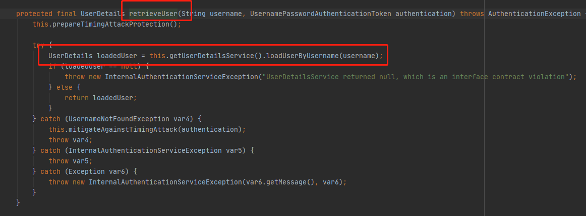
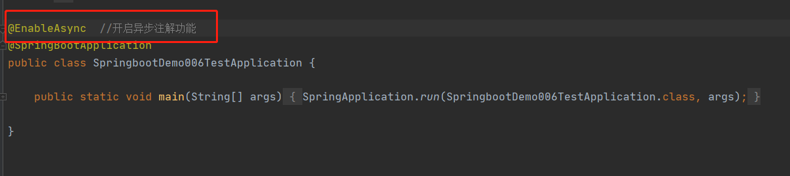
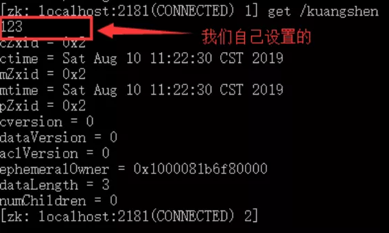

#  yaml语法

## 基本的用法


- 对空格的要求十分高 （比如如果name前没有空格 那么name和student是两个并列的对象）

  

## 给属性赋值的方法


- 实体类赋值


- 占位符 随机数玩法


## properties和yml的选择


## JSR303校验（不是很重要）


# 多环境配置及配置文件位置

- 在实际中我们的代码可能测试要一套环境 开发要一套环境等等，用这个可以轻松的切换环境


​                                                                                                           激活dev版本的环境

- yaml也可以把几套配置写一起

  

- 成功启用了test这套环境

  

# 自动装配

- 在配置文件中能配置的东西都有一个固有的规律
- xxxAutoConfiguration:自动装配，有默认值
- xxxProperties：和配置文件绑定，改变默认值，实现自定义配置
- 

# Springboot web 开发

## 静态资源


可以在这四个目录下放静态资源，可以直接访问


## 首页定制

- 将一个index.html放在

中的其中一个位置就行

## 图标更改

- 在static里直接放ico后缀的图片就行


# 模板引擎

- 需要使用thymeleaf，只要导入相应的依赖就可以。我们将html放在**templeates**目录下

```xml
<dependency>
    <groupId>org.thymeleaf</groupId>
    <artifactId>thymeleaf-spring5</artifactId>
</dependency>
<dependency>
    <groupId>org.thymeleaf.extras</groupId>
    <artifactId>thymeleaf-extras-java8time</artifactId>
</dependency>
```

第一步导入约束

```
<html lang="en" xmlns:th="http://www.thymeleaf.org">
```


- th属性，常用th属性如下：

  1）th:text：文本替换；

  2）th:utext：支持html的文本替换。

  3）th:value：属性赋值 

  4）th:each：遍历循环元素

  5）th:if：判断条件，类似的还有th:unless，th:switch，th:case

  6）th:insert：代码块引入，类似的还有th:replace，th:include，常用于公共代码块提取的场景

  7）th:fragment：定义代码块，方便被th:insert引用

  8）th:object：声明变量，一般和*{}一起配合使用，达到偷懒的效果。

  9）th:attr：设置标签属性，多个属性可以用逗号分隔


- 标准表达式语法：

`${...}` 变量表达式，Variable Expressions

`@{...}` 链接表达式，Link URL Expressions

`#{...}` 消息表达式，Message Expressions

`~{...}` 代码块表达式，Fragment Expressions

`*{...}` 选择变量表达式，Selection Variable Expressions


# springmvc扩展

```
//如果想diy一些自定义的组件，只要写这个组件，然后把他交给springboot，springboot就会帮我们自动装配
```

```
@Configuration
public class MyMvcConfig implements WebMvcConfigurer {

    @Bean
    public ViewResolver myViewResolver(){
        return new MyViewResolver();
    }


public static class MyViewResolver implements ViewResolver{
    @Override
    public View resolveViewName(String s, Locale locale) throws Exception {
        return null;
    }
}
}
```


```
//官方建议我们这样做，自己写一个类 加个configuration，类继承WebMvcConfigurer 重写方法

@Configuration
public class MyMvcConfig implements WebMvcConfigurer {


    @Override
    public void addViewControllers(ViewControllerRegistry registry) {
        registry.addViewController("/li").setViewName("/test");
    }
}
```

- 在springboot中 有非常多的xxxConfiguration 帮助我们进行扩展配置，只要看到这个东西我们就要关注它增加了什么功能。


# fragment实现前端代码复用

 将需要复用的组件写在里面


需要复用的地方 调用组件：


也可以在调用组件时候传参，配合tymeleaf语法实现一些功能（比如高亮之类的）：


# 登录功能实现（拦截器）

## 登录


## 拦截器

1. 写一个类继承HandlerInterceptor类 通过有无session判断是否通过登录进入业面 retrun false代表拦截  true代表通过

   

2.在启动类里重写addInterceptors方法 添加自己写的拦截器类  addPathPatterns里添加要拦截的路径  excludePathPatterns中代表可以访问的路径


# 数据的显示


## 时间日期格式化


## 修改 删除数据

# 路径的拼接


# 400 500


将页面放到templates下的error文件夹中即可 404.html就是走404错误 同样 500就是500.html 其他同理


# jdbc

yml配置：

```java
spring:
  datasource:
    username: root
    password: fhnbyyb123
    url: jdbc:mysql://localhost:3306/mybatis?useUnicode=true&characterEncodeing=UTF-8&useSSL=false&serverTimezone=Asia/Shanghai
```

使用**Jdbc Template**类实现sql：

```java
@RestController
public class JDBCController {
    @Autowired
    JdbcTemplate jdbcTemplate;                 //重点在于使用这个类

    //查询所有信息 没有实体类查询数据库的东西——Map
    @GetMapping("/userlist")
    public List<Map<String,Object>> userList()
    {
    String sql="select * from user";
        List<Map<String, Object>> maps = jdbcTemplate.queryForList(sql);
        return maps;
    }
    @GetMapping("/addUser")
    public String addUser(){
        String sql="insert into mybatis.user(id,name,pwd) values(6,'简七','3333')";
        jdbcTemplate.update(sql);
        return "update ok";
    }
}
```

# 整合Druid数据源

yml：

```java
spring:
  datasource:
    username: root
    password: fhnbyyb123
    url: jdbc:mysql://localhost:3306/mybatis?useUnicode=true&characterEncodeing=UTF-8&useSSL=false&serverTimezone=Asia/Shanghai
    driver-class-name: com.mysql.cj.jdbc.Driver
    type: com.alibaba.druid.pool.DruidDataSource

    #SpringBoot默认是不注入这些的，需要自己绑定
    #druid数据源专有配置
    initialSize: 5
    minIdle: 5
    maxActive: 20
    maxWait: 60000
    timeBetweenEvictionRunsMillis: 60000
    minEvictableIdleTimeMillis: 300000
    validationQuery: SELECT 1 FROM DUAL
    testWhileIdle: true
    testOnBorrow: false
    testOnReturn: false
    poolPreparedStatements: true

    #配置监控统计拦截的filters，stat：监控统计、log4j：日志记录、wall：防御sql注入
    #如果允许报错，java.lang.ClassNotFoundException: org.apache.Log4j.Properity
    #则导入log4j 依赖就行
    filters: stat,wall,log4j
    maxPoolPreparedStatementPerConnectionSize: 20
    useGlobalDataSourceStat: true
    connectionProperties: druid.stat.mergeSql=true;druid.stat.slowSqlMillis=500
```

**配置DruidConfig.java：**

```
package com.li.config;

import com.alibaba.druid.pool.DruidDataSource;
import com.alibaba.druid.support.http.StatViewServlet;
import org.springframework.boot.context.properties.ConfigurationProperties;
import org.springframework.boot.web.servlet.ServletRegistrationBean;
import org.springframework.context.annotation.Bean;
import org.springframework.stereotype.Controller;

import javax.sql.DataSource;
import java.util.HashMap;

@Controller
public class DruidConfig {


    @ConfigurationProperties(prefix = "spring.datasource")
    @Bean
    public DataSource druidDataSource(){
    return new DruidDataSource();
    }

    //后天监控: 相当于web.xml
    //因为SpringBoot内置了servlet容器 所以没有web.xml 替代方法: ServletRegistrationBean
    @Bean
    public ServletRegistrationBean a(){
        ServletRegistrationBean<StatViewServlet> bean = new ServletRegistrationBean<>(new StatViewServlet(), "/druid/*");
        //后天需要有人登录 账号密码配置
        HashMap<String, String> initParameters = new HashMap<>();
        initParameters.put("loginUsername","admin");    //loginUsername 和 loginPassword是固定的 因为反射
        initParameters.put("loginPassword","123456");

        //允许谁可以访问
        initParameters.put("allow","");
        bean.setInitParameters(initParameters);  //初始化参数
        return bean;

    }
    
        //fiter
    @Bean
    public FilterRegistrationBean filterRegistrationBean(){
        FilterRegistrationBean bean=new FilterRegistrationBean();
        bean.setFilter(new WebStatFilter());

        //可以过滤哪些请求
        HashMap<String, String> initParameters = new HashMap<>();
        
        //这些东西不进行统计
        initParameters.put("exclusions","*.js,*.css,/druid/*");
        return bean;
    }
}
```


# 整合mybatis

需要用到 mybatis-spring-boot-starter整合包：

```
<dependency>
    <groupId>org.mybatis.spring.boot</groupId>
    <artifactId>mybatis-spring-boot-starter</artifactId>
    <version>2.1.4</version>
</dependency>
```

1.编写UserMapper接口


2.在resource下新建目录 编写UserMapper.xml


3.在properties/yml中配置

```
mybatis.type-aliases-package=com.li.pojo

mybatis.mapper-locations=classpath:mybatis/mapper/*.xml
```

4.UserMapper.xml:

```
<?xml version="1.0" encoding="UTF-8" ?>
<!DOCTYPE mapper
        PUBLIC "-//mybatis.org//DTD Mapper 3.0//EN"
        "http://mybatis.org/dtd/mybatis-3-mapper.dtd">

<mapper namespace="com.li.mapper.UserMapper">

    <!--查询全部Book-->
    <select id="queryUserList" resultType="User">
      SELECT * from user
   </select>

    <!--根据id查询,返回一个Book-->
    <select id="queryUserById" resultType="User">
      select * from user
      where id = #{id}
   </select>

    <!--增加一个Book-->
    <insert id="addUser" parameterType="User">
      insert into user(id,name,pwd)
      values (#{id}, #{name}, #{pwd})
   </insert>

    <!--更新Book-->
    <update id="updateUser" parameterType="User">
      update ssmbuild.books
      set name = #{name},pwd = #{pwd}
      where id = #{id}
   </update>

    <!--根据id删除一个Book-->
    <delete id="deleteUser" parameterType="int">
      delete from user where id=#{id}
   </delete>
```

5.UserController实现UserMapper方法：


# SpringSecurity

依赖：

```
<dependency>
    <groupId>org.springframework.boot</groupId>
    <artifactId>spring-boot-starter-security</artifactId>
</dependency>
```


自己配置config类继承WebSecurityConfigurerAdapter类 重写configure方法 别忘记注解


认证与授权：

```java
@EnableWebSecurity
public class SecurityConfig extends WebSecurityConfigurerAdapter {
    //授权
    @Override
    protected void configure(HttpSecurity http) throws Exception {
        //首页所有人可以访问 但功能业只有对应有权限的人才能访问
        http.authorizeRequests().antMatchers("/").permitAll()
                                .antMatchers("/level1/**").hasRole("vip1")
                                .antMatchers("/level2/**").hasRole("vip2")
                                .antMatchers("/level3/**").hasRole("vip3");

        //没有权限默认到登录页
        http.formLogin();
                
        //开启注销
        http.logout();
        
        //开启记住我 默认两周
        http.rememberMe();    //可以写为http.rememberMe().rememberMeParameter("remember"); 即从前端收到remember才记住我
    }

    //认证
    //密码编码：PasswordEncoder
    //在spring security 5.0+ 新增了很多的加密方法
    @Override
    protected void configure(AuthenticationManagerBuilder auth) throws Exception {
        auth.inMemoryAuthentication().passwordEncoder(new BCryptPasswordEncoder())  //密码加密
                .withUser("li").password(new BCryptPasswordEncoder().encode("123456")).roles("vip2","vip3")
        .and()
        .withUser("root").password(new BCryptPasswordEncoder().encode("123456")).roles("vip1","vip2","vip3");

    }
}
```

## 结合数据库自定义账号密码

1.在数据库中写好用户表 包括账号密码角色等，写好角色表

2.写用户表实体类 实现UserDetails接口，或者先写好用户实体类，然后来个实现用UserDetails接口的类，在里面实现User


3.写一个MyUserDetailsService类实现UserDetailsService接口，重写loadUserByUsername，在里面根据用户名查数据表，找到对应的User，把它对应的role也放进去，并把它放在UserAuth里返回


4.在WebSecurityConfig中的Configure方法设置刚刚写好的myUserDetailsService


## springsecurity账号密码验证流程

1.账号密码首先要经过一个UsernamePasswordAuthenticationFilter过滤器，其实对账号密码的认证就在这里面，这里我重写这个类


2.UsernamePasswordAuthenticationFilter主要就是通过attemptAuthentication方法对传入的request请求（就是传进来的账号密码数据）进行处理，大致的流程，将request经过流操作读出username和password，然后调用userService.checkLogin方法（就是通过username取出数据库中的username和password，并且和传进来的username，password进行比对，详见2.1）对账号密码进行校验——

如果校验成功（返回true），则将账号密码写到一个新的token authrequest中去，并调用this.getAuthenticationManager().authenticate(authRequest)，这里做了什么？


2.1 userService.checkLogin方法 就是根据账号得到账号密码，如果为空返回false，如果正确返回true


3.this.getAuthenticationManager().authenticate(authRequest)做了什么？

**AuthenticationManager就是认证管理器，它的方法authenticate执行逻辑如下（默认配置\**DaoAuthenticationProvider\**，以DaoAuthenticationProvider为例）：**

（1）、判断是否有Authentication 对应的AuthenticationProvider，

​      有就执行AuthenticationProvider的authenticate方法，

​      没有就获取父类AuthenticationManager，查看父类中是否有Authentication 对应的AuthenticationProvider，

​         如果也没有则抛出ProviderNotFoundException异常


（2）执行AuthenticationProvider的authenticate方法

```java
ublic class DaoAuthenticationProvider extends AbstractUserDetailsAuthenticationProvider {
    //熟悉的supports，需要UsernamePasswordAuthenticationToken
    public boolean supports(Class<?> authentication) {
            return UsernamePasswordAuthenticationToken.class.isAssignableFrom(authentication);
        }

    public Authentication authenticate(Authentication authentication) throws AuthenticationException {
        	//取出Token里保存的值
            String username = authentication.getPrincipal() == null ? "NONE_PROVIDED" : authentication.getName();
            boolean cacheWasUsed = true;
        	//从缓存取
            UserDetails user = this.userCache.getUserFromCache(username);
            if (user == null) {
                cacheWasUsed = false;

                //啥，没缓存？使用retrieveUser方法获取呀
                user = this.retrieveUser(username, (UsernamePasswordAuthenticationToken)authentication);
            }
            //...删减了一大部分，这样更简洁
            Object principalToReturn = user;
            if (this.forcePrincipalAsString) {
                principalToReturn = user.getUsername();
            }

            return this.createSuccessAuthentication(principalToReturn, authentication, user);
        }
         protected final UserDetails retrieveUser(String username, UsernamePasswordAuthenticationToken authentication) throws AuthenticationException {
        try {
            //熟悉的loadUserByUsername
            UserDetails loadedUser = this.getUserDetailsService().loadUserByUsername(username);
            if (loadedUser == null) {
                throw new InternalAuthenticationServiceException("UserDetailsService returned null, which is an interface contract violation");
            } else {
                return loadedUser;
            }
        } catch (UsernameNotFoundException var4) {
            this.mitigateAgainstTimingAttack(authentication);
            throw var4;
        } catch (InternalAuthenticationServiceException var5) {
            throw var5;
        } catch (Exception var6) {
            throw new InternalAuthenticationServiceException(var6.getMessage(), var6);
        }
    }
	//检验密码
    protected void additionalAuthenticationChecks(UserDetails userDetails, UsernamePasswordAuthenticationToken authentication) throws AuthenticationException {
        if (authentication.getCredentials() == null) {
            this.logger.debug("Authentication failed: no credentials provided");
            throw new BadCredentialsException(this.messages.getMessage("AbstractUserDetailsAuthenticationProvider.badCredentials", "Bad credentials"));
        } else {
            String presentedPassword = authentication.getCredentials().toString();
            if (!this.passwordEncoder.matches(presentedPassword, userDetails.getPassword())) {
                this.logger.debug("Authentication failed: password does not match stored value");
                throw new BadCredentialsException(this.messages.getMessage("AbstractUserDetailsAuthenticationProvider.badCredentials", "Bad credentials"));
            }
        }
    }
}
```

​    1、拿出传进来的token的username，查看缓存中是否已经有有用户实体对象

​       如果有，则对密码重新验证；


​       如果没有，则进行用户的信息验证，执行DaoAuthenticationProvider中的retrieveUser方法，retireveUser就是调用我们写的DetailsService。loadUserByUsername方法，获取一个UserDetails对象




​          如果UserDetails对象为null或者获取时出错就抛出异常UsernameNotFoundException或AuthenticationServiceException异常，

​          然后一些属性验证之后，对用户密码进行验证。


前置判断：


判断密码是否正确：


第一个参数user是我们通过UserDetailService.loadbyusername 拿到的userauth（也就是说里面的账号密码是刚刚在数据库里拿出来），第二个参数authentication是我们刚刚在UsernamePasswordAuthenticationFilter解析request拿到username和password后创建的token

**就是说第一个是数据库拿到的信息，第二个是传进来的信息，正不正确？用passwordEncoder（大概就是一个处理加密数据比对的类）比一比**

**我觉得这里就是比对账号密码是否正确的核心啊——数据库的信息和表单的信息的比对**


后置判断，判断密码是否过期：


​    2、如果是新的UserDetails，那新获取的UserDetails对象放入缓存中，下次直接缓存里拿


​     3、新建一个UsernamePasswordAuthenticationToken一个对象，将authenticated设为true(原来传入的UsernamePasswordAuthenticationToken对象authenticated为false)并返回


也就是说，UsernamePasswordAuthenticationFilter校验账号密码后（其实用原生的UsernamePasswordAuthenticationFilter好像并没有校验，只是判断了一下是否为空），新建了一个未认证的token （authRequest），调用this.getAuthenticationManager().authenticate(authRequest)，对这个token中的信息进行一系列的校验，最后返回校验好的token。

# Shiro


# Swagger

## 使用swagger必需

在项目使用swagger需要springbox

- swagger2
- ui


1.新建springboot-web项目

2.导入相关依赖

```java
<dependency>
    <groupId>io.springfox</groupId>
    <artifactId>springfox-swagger2</artifactId>
    <version>2.9.2</version>
</dependency>
<dependency>
    <groupId>io.springfox</groupId>
    <artifactId>springfox-swagger-ui</artifactId>
    <version>2.9.2</version>
</dependency>
```

3.配置swagger config

```java
@Configuration
@EnableSwagger2 //开启swagger
public class SwaggerConfig {
}
```

4.测试：http://localhost:8080/swagger-ui.html


## 配置swagger

swagger的bean实例Docket

```
@Configuration
@EnableSwagger2 //开启swagger
public class SwaggerConfig {

    //配置了swagger的docket的bean实例
    @Bean
    public Docket docket(){
        return new Docket(DocumentationType.SWAGGER_2)
                .apiInfo(apiInfo());
    }

    //配置Swagger信息 apiInfo类

    private ApiInfo apiInfo(){
        Contact contact = new Contact("halfboiled", "", "850300117@qq.com");
        return new ApiInfo(
            "halfboiled Api",        //标题   
            "俺的api文档",          //描述
            "1.0",
            "urn:tos",
            contact, "Apache 2.0",
            "http://www.apache.org/licenses/LICENSE-2.0",
            new ArrayList()
                        );
    }
}
```


## swagger配置扫描接口

Docket.select（）

```java
public Docket docket(){
    return new Docket(DocumentationType.SWAGGER_2)
            .apiInfo(apiInfo())
            .groupName("lyf")  //配置分组
            .select()
            //RequestHandlerSelectors 配置要扫描接口的方式
            //basePackage:扫描指定包
            // any(）:扫描全部     none（）:不扫描
            // withClassAnnotation:扫描类上的注解，参数是一个一个注解的反射对象
            //withMethodAnnotation:扫描方法上的注解
            .apis(RequestHandlerSelectors.basePackage("com.li.controller"))
            //.paths(PathSelectors.ant(**))  只扫描**路径 即过滤其他路径
            .paths(PathSelectors.ant("/com/li"))
            .build();     //工厂模式
}
```

- .select().apis(/**/).paths(/**/).build()   通过.paths配置过滤  .apis()配置扫描对应的包 

- .enable（）表示是是否启动swagger

- .groupName("")用来设置分组 不同的Docket设不同的groupname 可以切换

### 小技巧：获取当前开发环境

 根据环境决定是否启动sawgger（可以学习如何获得环境的值（properties/yml））


## 实体类配置/注释

返回值中有实体类可以产生module


添加注释：


---


## 测试


## 总结swagger优点

1.可以通过swagger给一些属性或者类做注释

2.接口文档实时更新（代码一变 文档自动跟着变）

3.可以在线测试

swagger 优秀！

【注意】 在正式发布时 记得关闭swagger！出于安全考虑（不能公布接口），节省运行内存


# 异步任务

在实际中有些任务需要较长响应时间（比如点击发送邮箱，发送邮件需要一定时间，但需要成功键立马跳出来） 这就需要用到异步任务。

1.在启动项上用@EnableAsync 开启异步注解功能



2.在异步方法上加@Async


# 邮件任务

1.导入依赖

```
<dependency>
    <groupId>org.springframework.boot</groupId>
    <artifactId>spring-boot-starter-mail</artifactId>
</dependency>
```

2.配数据


3.发邮件

```java
@SpringBootTest
class SpringbootDemo006TestApplicationTests {


    @Autowired
     JavaMailSenderImpl mailSender;

    @Test
    void contextLoads() {
            //配置mailMessage 一个简单的邮件
            SimpleMailMessage mailMessage = new SimpleMailMessage();
            mailMessage.setSubject("half boiled hello!!");  //标题
            mailMessage.setText("这是用java发的邮件");      //正文
            mailMessage.setTo("850300117@qq.com");         //收件人
            mailMessage.setFrom("850300117@qq.com");       // 发件人
            mailSender.send(mailMessage);
    }

}
```


复杂邮件：

```java
void contextLoads2() throws MessagingException {
    //负责邮件
    MimeMessage mimeMessage=mailSender.createMimeMessage();
    //组装
    MimeMessageHelper helper = new MimeMessageHelper(mimeMessage,true);
    //标题
    helper.setSubject("反语！");
    //正文
    helper.setText("<p style='color:red'>试试逆反 试试java</p>",true);
    //附件
    helper.addAttachment("seven.jpg",new File("C:\\Users\\rog\\Desktop\\seven.jpg"));

    helper.setTo("1434850887@qq.com");         //收件人
    helper.setFrom("850300117@qq.com");       // 发件人
    mailSender.send(mimeMessage);
}
```

# 定时执行任务

```
1. TaskScheduler   任务调度执行
2. TaskExecutor      任务执行者
```

1.在启动项使用@EnableScheduling注解开启定时


2.写任务类 要执行的方法加@Scheduled（cron="    "）


## cron表达式 :

每一个域都使用数字，但还可以出现如下特殊字符，它们的含义是：
（1）*：表示匹配该域的任意值。假如在Minutes域使用*, 即表示每分钟都会触发事件。
（2）?：只能用在DayofMonth和DayofWeek两个域。它也匹配域的任意值，但实际不会。因为DayofMonth和DayofWeek会相互影响。例如想在每月的20日触发调度，不管20日到底是星期几，则只能使用如下写法： 13 13 15 20 * ?, 其中最后一位只能用？，而不能使用*，如果使用*表示不管星期几都会触发，实际上并不是这样。
（3）-：表示范围。例如在Minutes域使用5-20，表示从5分到20分钟每分钟触发一次
（4）/：表示起始时间开始触发，然后每隔固定时间触发一次。例如在Minutes域使用5/20,则意味着5分钟触发一次，而25，45等分别触发一次.
（5）,：表示列出枚举值。例如：在Minutes域使用5,20，则意味着在5和20分每分钟触发一次。
（6）L：表示最后，只能出现在DayofWeek和DayofMonth域。如果在DayofWeek域使用5L,意味着在最后的一个星期四触发。
（7）W:表示有效工作日(周一到周五),只能出现在DayofMonth域，系统将在离指定日期的最近的有效工作日触发事件。例如：在 DayofMonth使用5W，如果5日是星期六，则将在最近的工作日：星期五，即4日触发。如果5日是星期天，则在6日(周一)触发；如果5日在星期一到星期五中的一天，则就在5日触发。另外一点，W的最近寻找不会跨过月份 。
（8）LW:这两个字符可以连用，表示在某个月最后一个工作日，即最后一个星期五(有可能不是星期五，例如：某个月的31号为周二，那么此满足最后一个工作日，但不是周五。但是用于DayofWeek列确实如此)。
（9）#:用于确定每个月第几个星期几，只能出现在DayofMonth域。例如在4#2，表示某月的第二个星期三。
**常见的cron表达式:**

    0 0 2 1 * ? * 表示在每月的1日的凌晨2点调整任务
    
    0 15 10 ? * MON-FRI 表示周一到周五每天上午10:15执行作业
    
    0 15 10 ? 6L 2002-2006 表示2002-2006年的每个月的最后一个星期五上午10:15执行作
    
    0 0 10,14,16 * * ? 每天上午10点，下午2点，4点
    
    0 0/30 9-17 * * ? 朝九晚五工作时间内每半小时
    
    0 0 12 ? * WED 表示每个星期三中午12点
    
    0 0 12 * * ? 每天中午12点触发
    
    0 15 10 ? * * 每天上午10:15触发
    
    0 15 10 * * ? 每天上午10:15触发
    
    0 15 10 * * ? * 每天上午10:15触发
    
    0 15 10 * * ? 2005 2005年的每天上午10:15触发
    
    0 * 14 * * ? 在每天下午2点到下午2:59期间的每1分钟触发
    
    0 0/5 14 * * ? 在每天下午2点到下午2:55期间的每5分钟触发
    
    0 0/5 14,18 * * ? 在每天下午2点到2:55期间和下午6点到6:55期间的每5分钟触发
    
    0 0-5 14 * * ? 在每天下午2点到下午2:05期间的每1分钟触发

# 分布式 Dubbo+Zookeeper+springboot

“分布式系统是若干独立计算机的集合，这些计算机对于用户来说就像单个相关系统

用http或者RPC实现计算机之间的联系

## Zookeeper

1、下载zookeeper ：地址， 我们下载3.4.14 ， 最新版！解压zookeeper

2、运行/bin/zkServer.cmd ，初次运行会报错，没有zoo.cfg配置文件；

可能遇到问题：闪退 !

解决方案：编辑zkServer.cmd文件末尾添加pause 。这样运行出错就不会退出，会提示错误信息，方便找到原因。


3、修改zoo.cfg配置文件

将conf文件夹下面的zoo_sample.cfg复制一份改名为zoo.cfg即可。

注意几个重要位置：

dataDir=./  临时数据存储的目录（可写相对路径）

clientPort=2181  zookeeper的端口号

修改完成后再次启动zookeeper


4、使用zkCli.cmd测试

ls /：列出zookeeper根下保存的所有节点

```
[zk: 127.0.0.1:2181(CONNECTED) 4] ls /
[zookeeper]
```

create –e /kuangshen 123：创建一个kuangshen节点，值为123


get /kuangshen：获取/kuangshen节点的值



我们再来查看一下节点


## Dubbo

Dubbo是一款prc框架 而zookeeper是它推荐的一款注册中心（Registry）


## Dubbo-admin(dubbo可视化界面可选)

dubbo本身并不是一个服务软件。它其实就是一个jar包，能够帮你的java程序连接到zookeeper，并利用zookeeper消费、提供服务。

但是为了让用户更好的管理监控众多的dubbo服务，官方提供了一个可视化的监控程序dubbo-admin，不过这个监控即使不装也不影响使用。

我们这里来安装一下：

**1、下载dubbo-admin**

地址 ：https://github.com/apache/dubbo-admin/tree/master

**2、解压进入目录**

修改 dubbo-admin\src\main\resources \application.properties 指定zookeeper地址

```
server.port=7001
spring.velocity.cache=false
spring.velocity.charset=UTF-8
spring.velocity.layout-url=/templates/default.vm
spring.messages.fallback-to-system-locale=false
spring.messages.basename=i18n/message
spring.root.password=root
spring.guest.password=guest

dubbo.registry.address=zookeeper://127.0.0.1:2181
```

**3、在项目目录下**打包dubbo-admin

```
mvn clean package -Dmaven.test.skip=true
```

**第一次打包的过程有点慢，需要耐心等待！直到成功！**


4、执行 dubbo-admin\target 下的dubbo-admin-0.0.1-SNAPSHOT.jar

```
java -jar dubbo-admin-0.0.1-SNAPSHOT.jar
```

【注意：zookeeper的服务一定要打开！】

执行完毕，我们去访问一下 http://localhost:7001/ ， 这时候我们需要输入登录账户和密码，我们都是默认的root-root；

登录成功后，查看界面


安装完成！

## SpringBoot + Dubbo + zookeeper整合

**1. 启动zookeeper ！**

**2. IDEA创建一个空项目；**

**3.创建一个模块，实现服务提供者：provider-server ， 选择web依赖即可**

**4.项目创建完毕，我们写一个服务，比如卖票的服务；**

编写接口

```
package com.kuang.provider.service;

public interface TicketService {
   public String getTicket();
}
```

编写实现类

```
package com.kuang.provider.service;

public class TicketServiceImpl implements TicketService {
   @Override
   public String getTicket() {
       return "《狂神说Java》";
  }
}
```

**5.创建一个模块，实现服务消费者：consumer-server ， 选择web依赖即可**

**6.项目创建完毕，我们写一个服务，比如用户的服务；**

编写service

```
package com.kuang.consumer.service;

public class UserService {
   //我们需要去拿去注册中心的服务
}
```

**需求：现在我们的用户想使用买票的服务，这要怎么弄呢 ？**


**服务提供者**

**1、将服务提供者注册到注册中心，我们需要整合Dubbo和zookeeper，所以需要导包**

**我们从dubbo官网进入github，看下方的帮助文档，找到dubbo-springboot，找到依赖包**

```
<!-- Dubbo Spring Boot Starter -->
<dependency>
   <groupId>org.apache.dubbo</groupId>
   <artifactId>dubbo-spring-boot-starter</artifactId>
   <version>2.7.3</version>
</dependency>    
```

**zookeeper的包我们去maven仓库下载，zkclient；**

```
<!-- https://mvnrepository.com/artifact/com.github.sgroschupf/zkclient -->
<dependency>
   <groupId>com.github.sgroschupf</groupId>
   <artifactId>zkclient</artifactId>
   <version>0.1</version>
</dependency>
```

**【新版的坑】zookeeper及其依赖包，解决日志冲突，还需要剔除日志依赖；**

```
<!-- 引入zookeeper -->
<dependency>
   <groupId>org.apache.curator</groupId>
   <artifactId>curator-framework</artifactId>
   <version>2.12.0</version>
</dependency>
<dependency>
   <groupId>org.apache.curator</groupId>
   <artifactId>curator-recipes</artifactId>
   <version>2.12.0</version>
</dependency>
<dependency>
   <groupId>org.apache.zookeeper</groupId>
   <artifactId>zookeeper</artifactId>
   <version>3.4.14</version>
   <!--排除这个slf4j-log4j12-->
   <exclusions>
       <exclusion>
           <groupId>org.slf4j</groupId>
           <artifactId>slf4j-log4j12</artifactId>
       </exclusion>
   </exclusions>
</dependency>
```

**2、在springboot配置文件中配置dubbo相关属性！**

```
#当前应用名字
dubbo.application.name=provider-server
#注册中心地址
dubbo.registry.address=zookeeper://127.0.0.1:2181
#扫描指定包下服务
dubbo.scan.base-packages=com.kuang.provider.service
```

**3、在service的实现类中配置服务注解，发布服务！注意导包问题**

```
import org.apache.dubbo.config.annotation.Service;
import org.springframework.stereotype.Component;

@Service //将服务发布出去
@Component //放在容器中
public class TicketServiceImpl implements TicketService {
   @Override
   public String getTicket() {
       return "《狂神说Java》";
  }
}
```

**逻辑理解 ：应用启动起来，dubbo就会扫描指定的包下带有@component注解的服务，将它发布在指定的注册中心中！**


**服务消费者**

**1、导入依赖，和之前的依赖一样；**

```
<!--dubbo-->
<!-- Dubbo Spring Boot Starter -->
<dependency>
   <groupId>org.apache.dubbo</groupId>
   <artifactId>dubbo-spring-boot-starter</artifactId>
   <version>2.7.3</version>
</dependency>
<!--zookeeper-->
<!-- https://mvnrepository.com/artifact/com.github.sgroschupf/zkclient -->
<dependency>
   <groupId>com.github.sgroschupf</groupId>
   <artifactId>zkclient</artifactId>
   <version>0.1</version>
</dependency>
<!-- 引入zookeeper -->
<dependency>
   <groupId>org.apache.curator</groupId>
   <artifactId>curator-framework</artifactId>
   <version>2.12.0</version>
</dependency>
<dependency>
   <groupId>org.apache.curator</groupId>
   <artifactId>curator-recipes</artifactId>
   <version>2.12.0</version>
</dependency>
<dependency>
   <groupId>org.apache.zookeeper</groupId>
   <artifactId>zookeeper</artifactId>
   <version>3.4.14</version>
   <!--排除这个slf4j-log4j12-->
   <exclusions>
       <exclusion>
           <groupId>org.slf4j</groupId>
           <artifactId>slf4j-log4j12</artifactId>
       </exclusion>
   </exclusions>
</dependency>
```

2、**配置参数**

```
#当前应用名字
dubbo.application.name=consumer-server
#注册中心地址
dubbo.registry.address=zookeeper://127.0.0.1:2181
```

**3. 本来正常步骤是需要将服务提供者的接口打包，然后用pom文件导入，我们这里使用简单的方式，直接将服务的接口拿过来，路径必须保证正确，即和服务提供者相同；**


**4. 完善消费者的服务类**

```
package com.kuang.consumer.service;

import com.kuang.provider.service.TicketService;
import org.apache.dubbo.config.annotation.Reference;
import org.springframework.stereotype.Service;

@Service //注入到容器中
public class UserService {

   @Reference //远程引用指定的服务，他会按照全类名进行匹配，看谁给注册中心注册了这个全类名
   TicketService ticketService;

   public void bugTicket(){
       String ticket = ticketService.getTicket();
       System.out.println("在注册中心买到"+ticket);
  }

}
```

**5. 测试类编写；**

```
@RunWith(SpringRunner.class)
@SpringBootTest
public class ConsumerServerApplicationTests {

   @Autowired
   UserService userService;

   @Test
   public void contextLoads() {

       userService.bugTicket();

  }

}
```


启动测试

**1. 开启zookeeper**

**2. 打开dubbo-admin实现监控【可以不用做】**

**3. 开启服务者**

**4. 消费者消费测试，结果：**


**监控中心 ：**


**ok , 这就是SpingBoot + dubbo + zookeeper实现分布式开发的应用，其实就是一个服务拆分的思想；**