# springcloud  入门

四个核心问题：

1.服务很多，客户端该怎么访问？ （路由）

2.这么多服务 服务之间如何通信 （通信）

3.这么多服务 如何治理  （高可用）

4.服务挂了怎么办？ （服务降级）

 究其本质原因——网络不可靠！


解决方案：

1. Spring Cloud NetFlix  一站式解决方案

   api网关 zuul组件解决第一个问题

   Feign---HttpClinet---Http 通信方式，同步、阻塞

   服务注册发现：Eureka

   熔断机制：Hystrix

   

2. Apache Dubbo Zookeeper   半自动需要整合别人

   Api：没有，找第三方 或者自己实现

   Dubbo

   Zookeeper

   没有熔断机制：借助Hystrix

   

3. Spring Cloud Alibaba   最新的一站式解决方案！更简单


万变不离其宗：1.Api  2.Http,RPC  3.注册和发现 4.熔断机制

# 参考

- spring cloud NetFlix 中文文档：https://www.springcloud.cc/spring-cloud-netflix.html
- springcloud 中文API文档：https://www.springcloud.cc/spring-cloud-dalston.html
- springcloud中国社区：http://springcloud.cn/
- springcloud中文网：https://www.springcloud.cc/


# Springcloud父类pom（常用）

```
<?xml version="1.0" encoding="UTF-8"?>
<project xmlns="http://maven.apache.org/POM/4.0.0"
         xmlns:xsi="http://www.w3.org/2001/XMLSchema-instance"
         xsi:schemaLocation="http://maven.apache.org/POM/4.0.0 http://maven.apache.org/xsd/maven-4.0.0.xsd">
    <modelVersion>4.0.0</modelVersion>

    <groupId>com.li</groupId>
    <artifactId>SpringCloud</artifactId>
    <version>1.0-SNAPSHOT</version>
    <modules>
        <module>springcloud-api</module>
        <module>springcloud-provider-dept8001</module>
        <module>springcloud-consumer-dept-80</module>
        <module>springcloud-eureka-7001</module>
    </modules>

    <!--打包方式 oom -->
    <packaging>pom</packaging>

    <properties>
        <project.build.sourceEncoding>UTF-8</project.build.sourceEncoding>
        <maven.compiler.source>1.8</maven.compiler.source>
        <maven.compiler.target>1.8</maven.compiler.target>
        <junit.version>4.10</junit.version>
        <log4j.version>1.2.17</log4j.version>
        <lombok.version>1.16.18</lombok.version>
    </properties>

    <dependencyManagement>
        <dependencies>
                <!--springcloud依赖 -->
            <dependency>
                <groupId>org.springframework.cloud</groupId>
                <artifactId>spring-cloud-dependencies</artifactId>
                <version>2020.0.2</version>
                <type>pom</type>
                <scope>import</scope>
            </dependency>
            <!--springboot-->
            <dependency>
                <groupId>org.springframework.boot</groupId>
                <artifactId>spring-boot-dependencies</artifactId>
                <version>2.4.4</version>
                <type>pom</type>
                <scope>import</scope>
            </dependency>
            <!-- 数据库-->
            <dependency>
                <groupId>mysql</groupId>
                <artifactId>mysql-connector-java</artifactId>
                <version>5.1.47</version>
                <type>pom</type>
                <scope>import</scope>
            </dependency>
            <dependency>
                <groupId>com.alibaba</groupId>
                <artifactId>druid</artifactId>
                <version>1.1.10</version>
            </dependency>
        <!-- springboot 启动器-->
            <dependency>
                <groupId>org.mybatis.spring.boot</groupId>
                <artifactId>mybatis-spring-boot-starter</artifactId>
                <version>2.1.4</version>
            </dependency>
            <!-- log4j -->
            <dependency>
                <groupId>junit</groupId>
                <artifactId>junit</artifactId>
                <version>4.12</version>
            </dependency>
            <!--日志测试~-->
            <dependency>
                <groupId>ch.qos.logback</groupId>
                <artifactId>logback-core</artifactId>
                <version>1.2.3</version>
            </dependency>

            <dependency>
                <groupId>log4j</groupId>
                <artifactId>log4j</artifactId>
                <version>${log4j.version}</version>
            </dependency>
            <dependency>
                <groupId>org.projectlombok</groupId>
                <artifactId>lombok</artifactId>
                <version>${lombok.version}</version>
            </dependency>
        </dependencies>
    </dependencyManagement>

</project>
```


# 简单的环境搭建

服务提供者的controller：

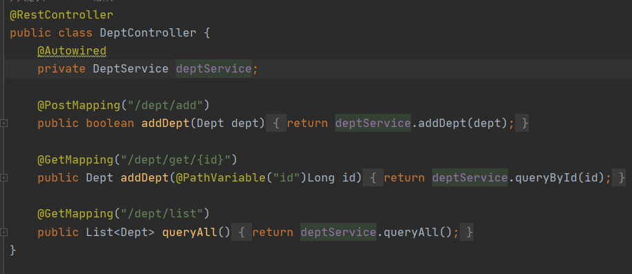

服务消费者的controller：

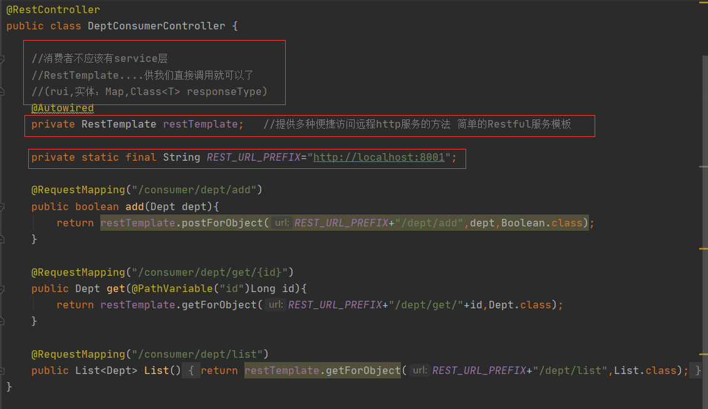

核心是RestTemplate 可以提供访问远程http服务的方法，这样一来我们就可以根据服务提供者的端口号去获取服务了

记得RestTemplate是要自己配置到bean的：

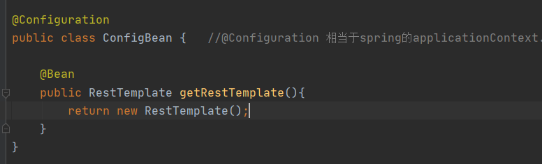

# Eureka

基于REST的服务用于定位服务，实现服务注册，功能类似于zookeeper 即服务注册中心

## eureka和zookeeper的区别

eureka遵循cap中的ap原则

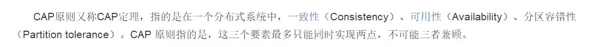

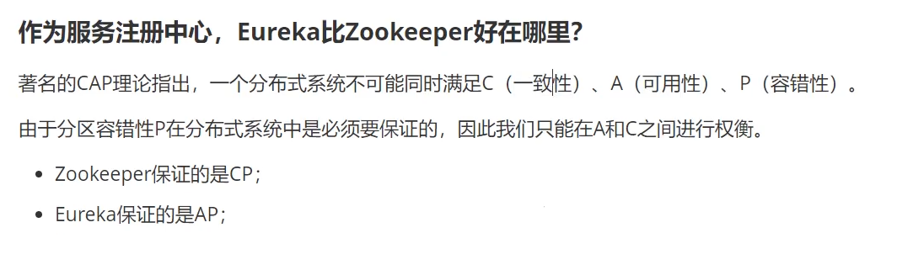


- 一句话说：zookeeper追求的是让用户获得的数据是最新的，但这可能会导致瘫痪；而eureka虽然不能保证数据是最新的，但很少完全挂掉。eureka可以很好地应对因网络故障导致的部分节点失去联系。而不会像zookeeper那样整个注册服务瘫痪。

## eureka依赖

```java
<--! eureka服务器端 -->
    
<dependencies>
    <dependency>
        <groupId>org.springframework.cloud</groupId>
        <artifactId>spring-cloud-starter-netflix-eureka-server</artifactId>
    </dependency>
</dependencies>
    
    
<!--eureka 提供者端-->
    <dependency>
        <groupId>org.springframework.cloud</groupId>
        <artifactId>spring-cloud-starter-eureka</artifactId>
        <version>1.4.7.RELEASE</version>
    </dependency>
    
 <!-- 在eureka中完善监控信息 actuator-->
    <dependency>
        <groupId>org.springframework.boot</groupId>
        <artifactId>spring-boot-starter-actuator</artifactId>
    </dependency>
```

## eureka注册中心服务器端

1.导入eureka服务器端依赖

2.配置application

```
server:
  port: 7001

  #Eureka配置
eureka:
  instance:
    hostname: localhost #Eureka服务端的实例名称
  client:
    register-with-eureka: false   #表示是否向eureka注册中心注册自己 这里在写服务器 不需要注册自己
    fetch-registry: false  #如果为false  表示自己为注册中心
    service-url:   #监控业面
      defaultZone: http://${eureka.instance.hostname}:${server.port}/eureka/
```

3.启动类 加注解

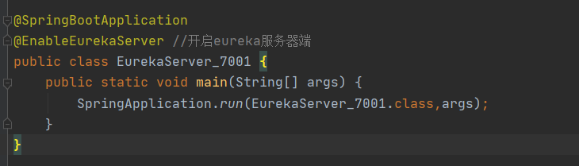

4.访问http://localhost:7001/即可  （7001是自己配的端口）

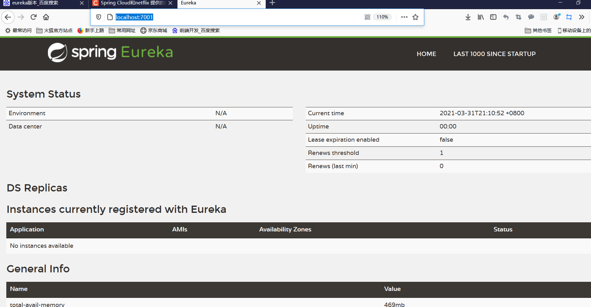

## eureka 要注册到服务器端的提供者

1.导入eureka提供者依赖和actuator依赖（可选）

2.配置application

```
#eureka提供者端配置
eureka:
  client:
    service-url:
      defaultZone: http://localhost:7001/eureka/ #这里的地址是刚刚配置的服务器端的url
  instance:
    instance-id: springcloud-provider-dept8001 #修改eureka上默认描述
    
#info配置  actuator   可选可不选  就是配置默认描述被点击后的东西
info:
  app.name: lyf-springcloud
  company.name: www.lllyf.com
```

3.启动类 加注解

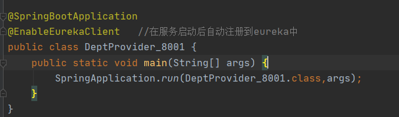

### 服务发现 提供注册进来的微服务的具体信息

1、controller写类

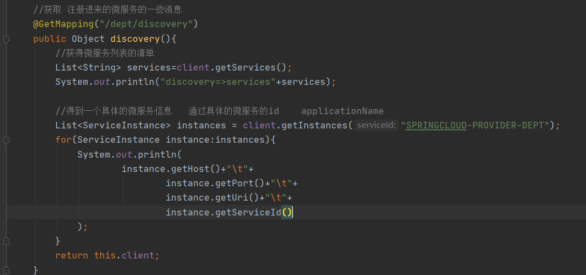

2.注解开启功能

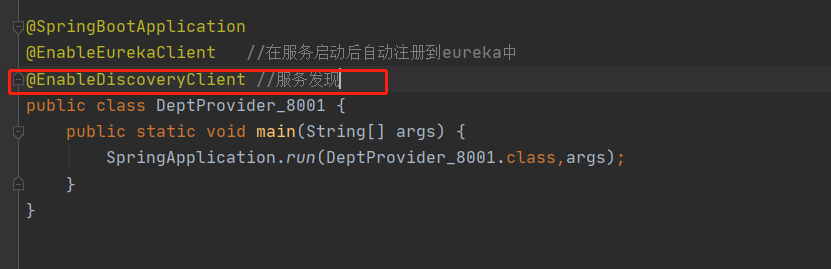

3.结果

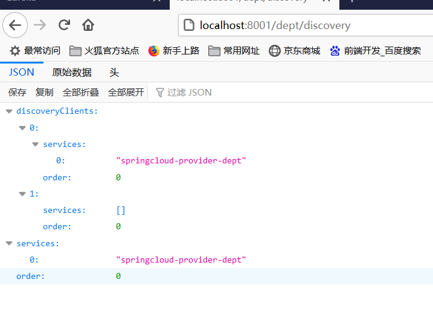

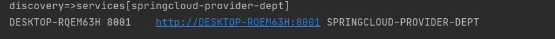

可以看到注册进来的微服务的一些具体信息

## eureka客户端端

Controller写法， 通过提供者在eureka注册中心注册的服务名来得到信息

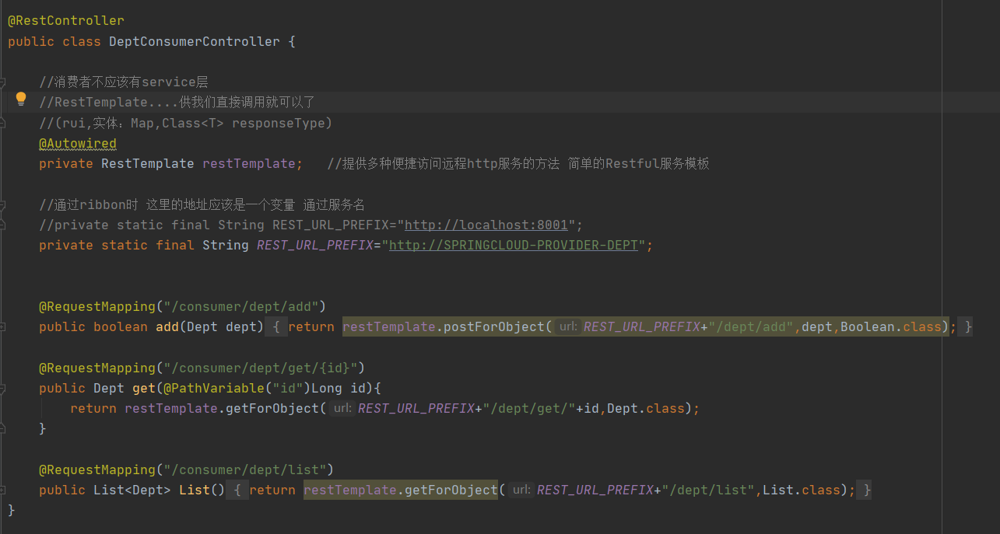


## eureka集群

比如有三个微服务 eureka7001 eureka7002 和 eureka7003   三个微服务之间要相互关联

1.配置三个eureka服务器端 用defaultZone相互关联

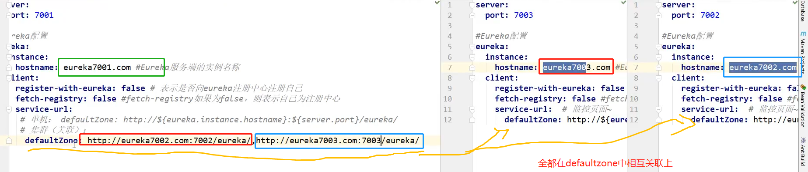

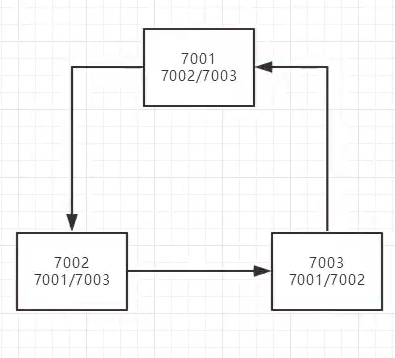

2.要注册到eureka服务器端的  提供者  的配置信息需要更改， 将注册信息改到刚刚搭好的集群上

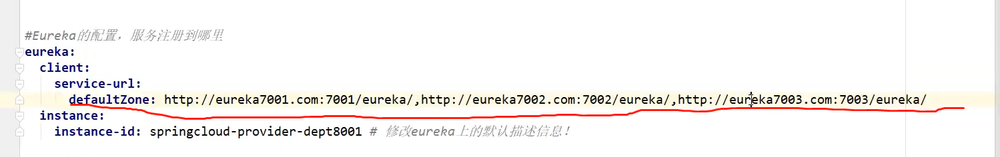

3.配置成功后每个eureka节点都会配置进集群内其他节点 一个eureka崩了 其他的还在，实现负载均衡 + 故障容错！！

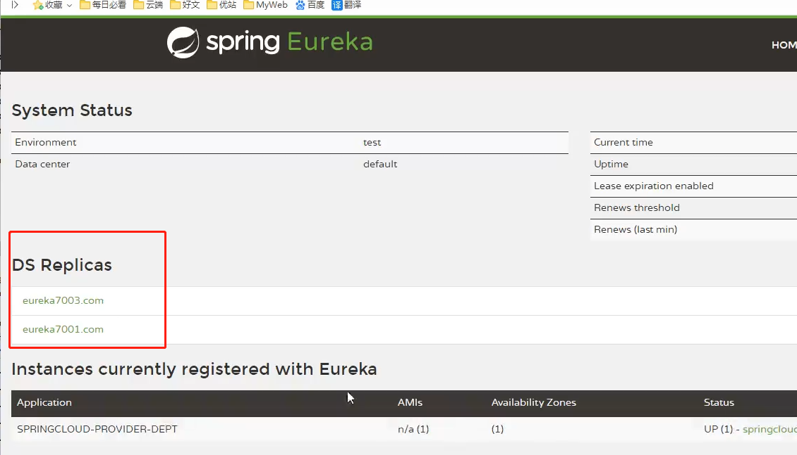

# Ribbon

- spring cloud ribbon是基于Netflix Ribbon实现的一套客户端负载均衡工具

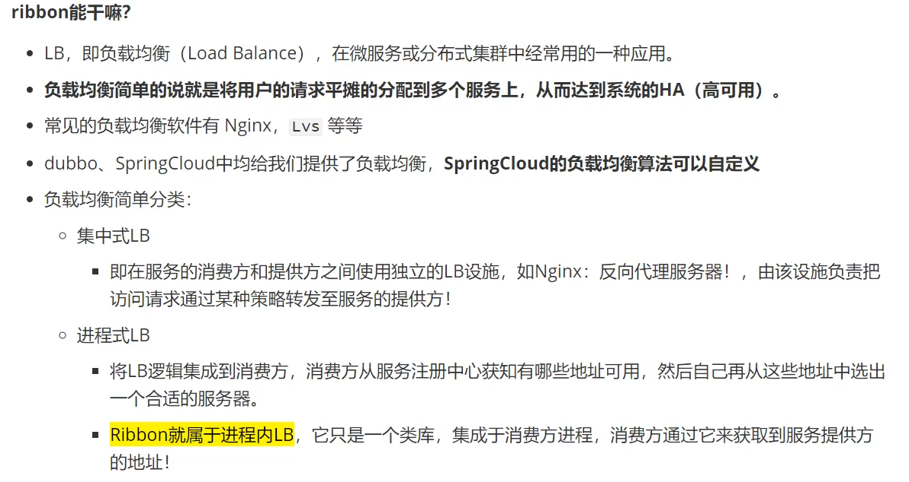

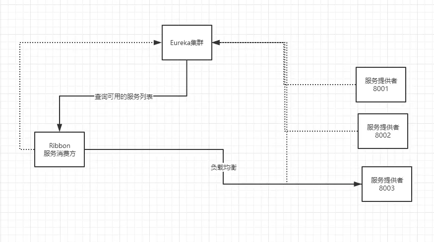

## ribbon依赖

注意！spring-cloud-starter-netflix-eureka-client 3.0版以后自己集成了ribbon  不需要再导入ribbon依赖 否则会有报错，显示 No instances available for xxxx错误！！！

```
<!-- ribbon     新版eureka已集成不需要加-->
<dependency>
    <groupId>org.springframework.cloud</groupId>
    <artifactId>spring-cloud-starter-netflix-ribbon</artifactId>
    <version>2.2.7.RELEASE</version>
</dependency>
```

1.导依赖

2.配置application.yml

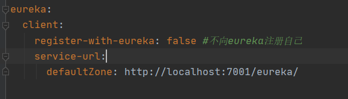

3.注解

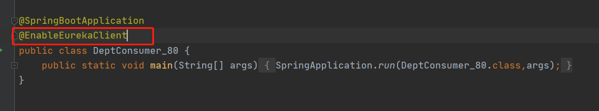

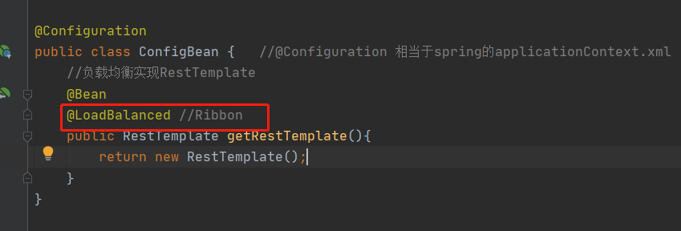

## Ribbon 自定义负载均衡算法

可以通过写自定义类来自定义负载均衡方法

在启动类的@RibbonClient中写入自定义类名字就行

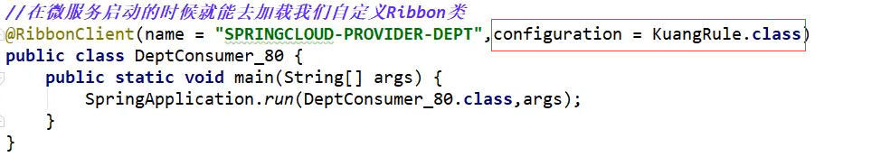

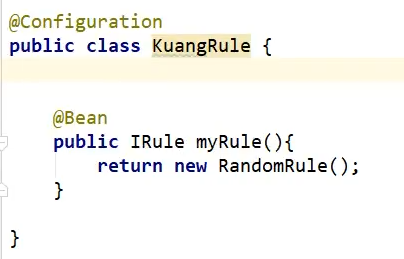


# Feign

Feign是声明式的web service客户端，它使微服务之间的调用变得简单了，类似Controller调用Service。springcloud集成了Ribbon和Eureka，也可以使用Feign时提供负载均衡的http客户端。

1.依赖

```
<!-- Feign-->
<dependency>
    <groupId>org.springframework.cloud</groupId>
    <artifactId>spring-cloud-starter-openfeign</artifactId>
    <version>2.2.7.RELEASE</version>
</dependency>
```

2.客户端的 Service层注册类接口写法

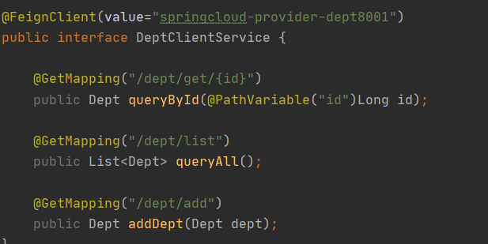

3.提供者类Controller层写法

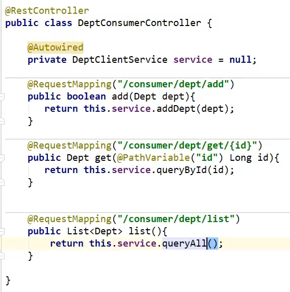

4.客户端加注解

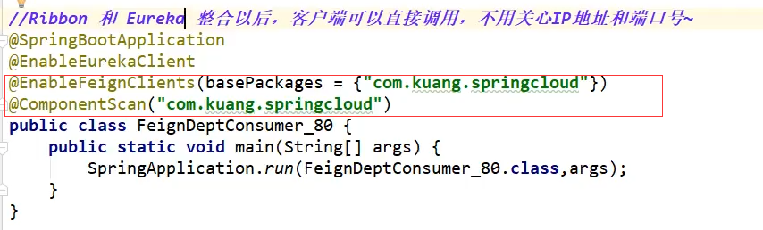

## Feign和ribbon区别

feign主要是社区 大家都习惯接口编程。

ribbon通过微服务名字来访问

feign通过接口和注解来访问

# Hystrix

服务器雪崩


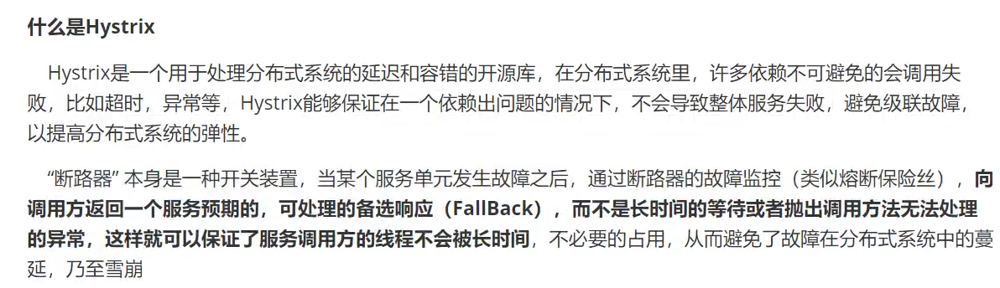

## Hystrix依赖

```
<!--Hystrix-->
<dependency>
    <groupId>org.springframework.cloud</groupId>
    <artifactId>spring-cloud-starter-netflix-hystrix</artifactId>
    <version>2.2.1.RELEASE</version>
</dependency>
```

## 服务熔断

熔断机制是对应雪崩效应的一种微服务链路保护机制。

当扇出链路的某个微服务不可用或者响应时间太长，会进行服务的降级，进而熔断该节点的微服务调用，快速返回错误的响应信息。Springclou中的熔断机制通过Hystrix实现，Hystrix会监控微服务之间调用的状况，当失败的调用到一定阈值，缺省是5秒内20次调用失败就会启动熔断计指，熔断机制的注解是@HystrixCommand。

1.导入依赖

2.controller类提供备选函数，加注解

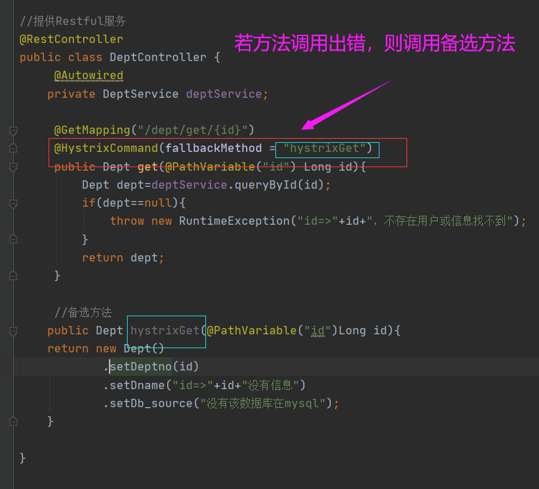

3.启动类加注解开启服务

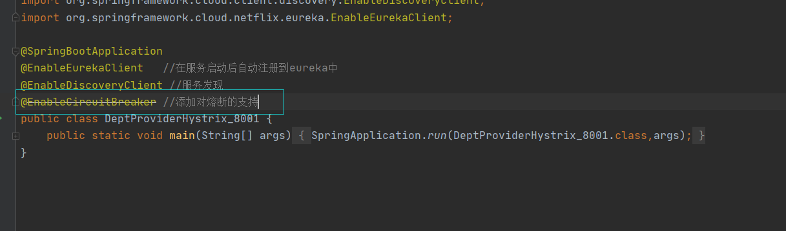

## 服务降级

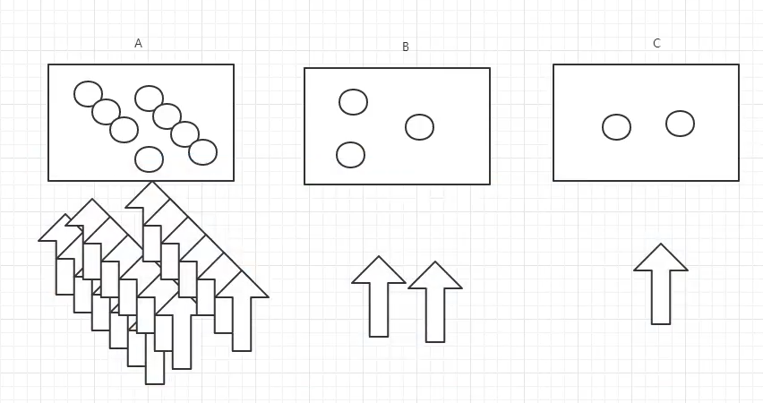

比如A在某个时间段高并发了。那可以关掉B和C的服务，去帮助完成A的业务。例如：双十一关掉退款服务

这就是服务降级

### 实现方法

1.导入依赖

2.一个回调方法工厂类 集成FallbackFactory 重写create

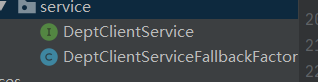

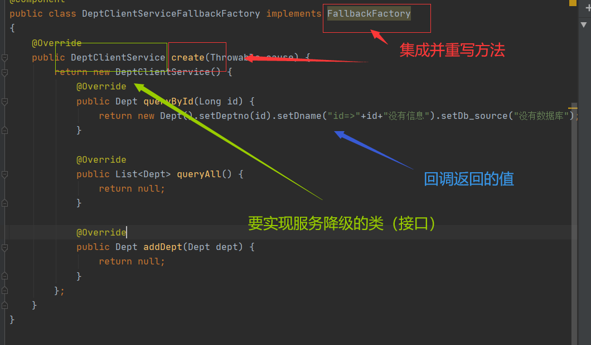

3.在客户端实现服务降级的类（接口）加注解

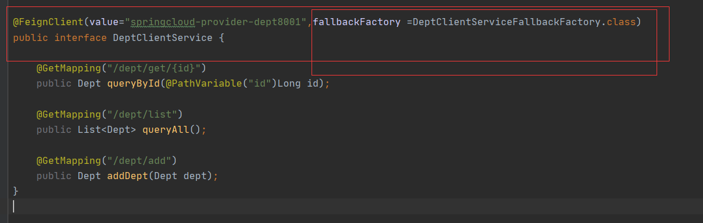

4.feign服务器端的yml文件开启降级feign.hystrix

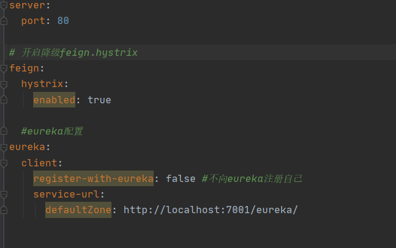

之后去访问请求，即使服务被关了，任然可以返回FallbackFactory 里提供的值，而不是直接崩掉

## 服务熔断和服务降级比较

**服务熔断**：在服务端    某个服务超时或异常 引起熔断 相当于保险丝

**服务降级**：在客户端  从整体网站求情负载考虑，当某个服务熔断或者关闭后，服务将不再被调用，此时在客户端我们可以准备一个FallbackFactory 返回一个默认值 整体的服务水平下降了  但好歹能用

## Dashboard流监控

1.dashboard端口模块要导入hystrix和dashboard依赖

```
        <!--Hystrix-->
        <dependency>
            <groupId>org.springframework.cloud</groupId>
            <artifactId>spring-cloud-starter-netflix-hystrix</artifactId>
            <version>2.2.7.RELEASE</version>
        </dependency>
        <!--dashboard依赖 -->
        <dependency>
            <groupId>org.springframework.cloud</groupId>
            <artifactId>spring-cloud-starter-netflix-hystrix-dashboard</artifactId>
            <version>2.2.7.RELEASE</version>
        </dependency>
```

- dashboard端口模块启动类加上@EnableHystrixDashboard

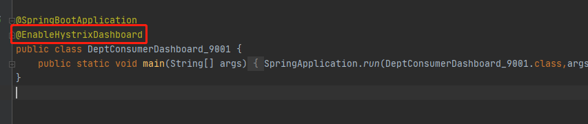

- dashboard端口模块的yml要配置一下hystrix.dashboard.proxyStreamAllowList   (不一定会出现这个问题 但保险起见)

  ```
  server:
    port: 9001
  
  hystrix:
    dashboard:
      proxyStreamAllowList: "localhost"
  ```

2.被监控的服务的pom中要有监控的包 actuator和hystrix

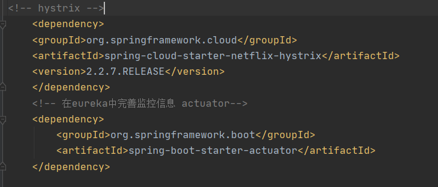

3.被监控的服务的启动类要加一个servlet保证被监控 并开启对熔断的支持 controller上有熔断注解（dashboard是对熔断数据的监控）

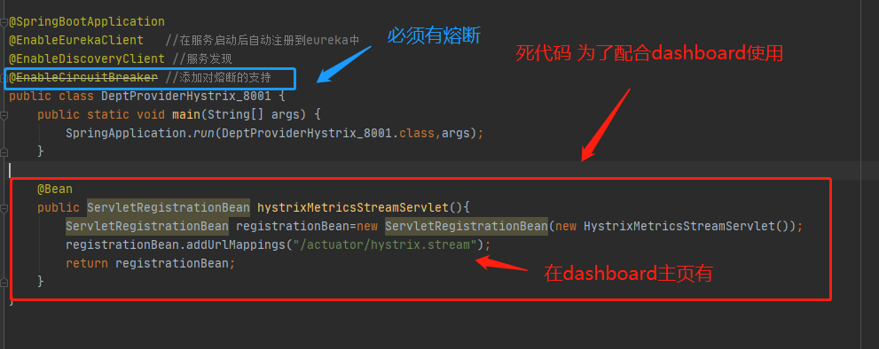

```
    @Bean
    public ServletRegistrationBean hystrixMetricsStreamServlet(){
        ServletRegistrationBean registrationBean=new ServletRegistrationBean(new HystrixMetricsStreamServlet());
        registrationBean.addUrlMappings("/actuator/hystrix.stream ");
        return registrationBean;
    }
```

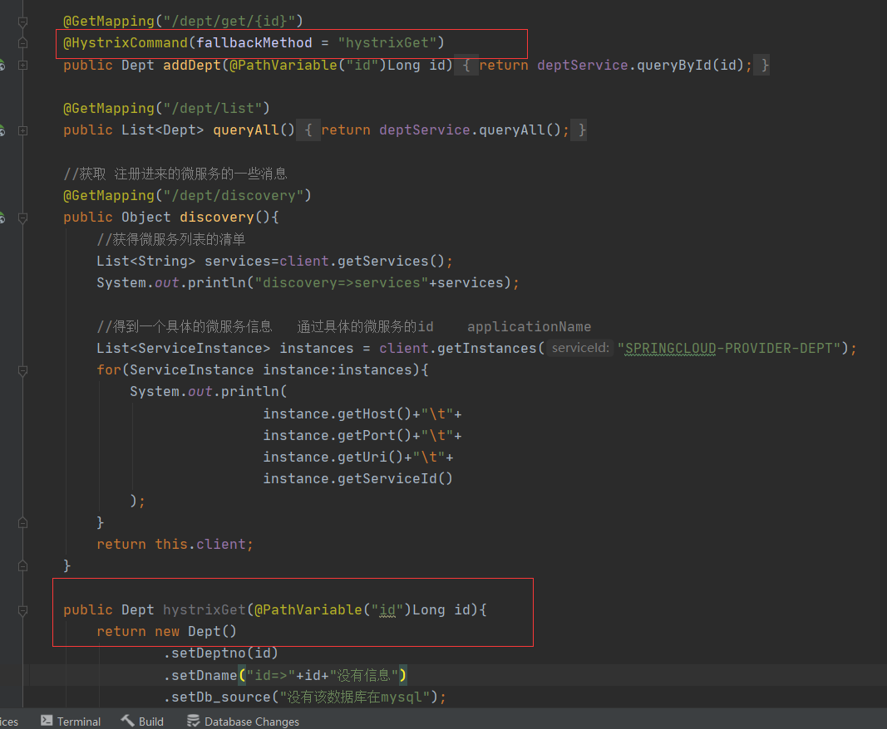

4.启动类加注解

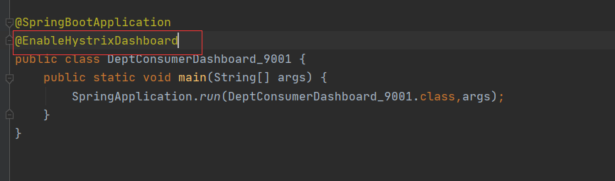

5.直接访问/hystrix     9001的端口的话是：http://localhost:9001/hystrix

6.注册进端口，可以看到信息

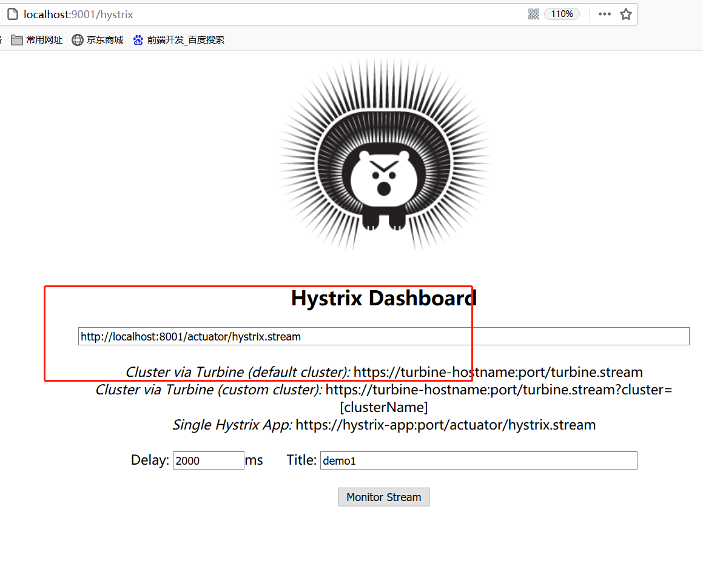


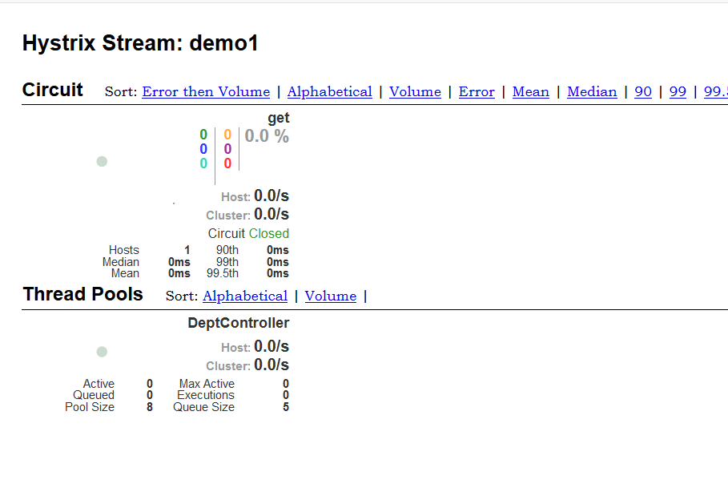

# zuul路由网关

zuul包含了对请求的路由和过滤两个最主要的功能。

- 路由

- 过滤

  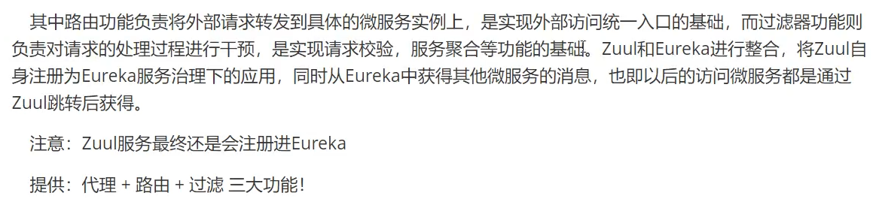

  

## zuul依赖

```
<!--zuul。还要导入eureka-->
<dependency>
    <groupId>org.springframework.cloud</groupId>
    <artifactId>spring-cloud-starter-netflix-zuul</artifactId>
    <version>2.2.7.RELEASE</version>
</dependency>

<!-- eureka -->
<dependency>
    <groupId>org.springframework.cloud</groupId>
    <artifactId>spring-cloud-starter-eureka</artifactId>
    <version>1.4.7.RELEASE</version>
</dependency>
```

## zuul服务开启

1.导入zuul和eureka依赖

2.启动类加注解@EnableZuulProxy

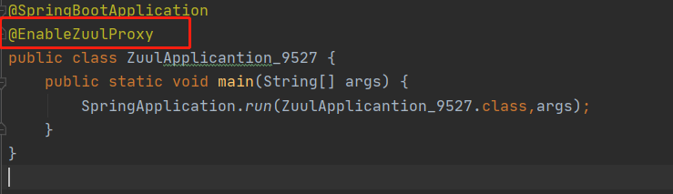

3.application.yml配置一下 注册到eureka里

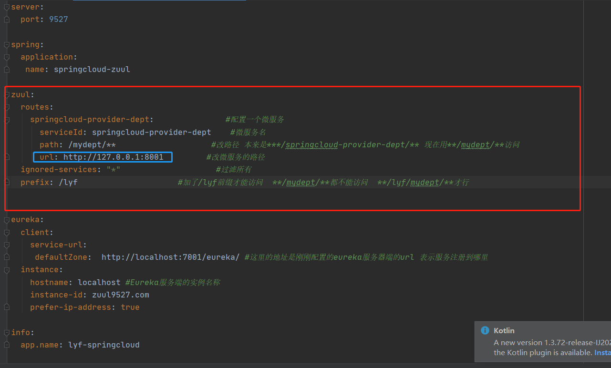

4.访问 注意这里本来的/springcloud-provider-dept/ （本来是微服务的名字）改成了/mydept/   然后必须要带前缀/lyf/   这都是zuul配置的

www.lyf.com是自己改的  相当于localhost       

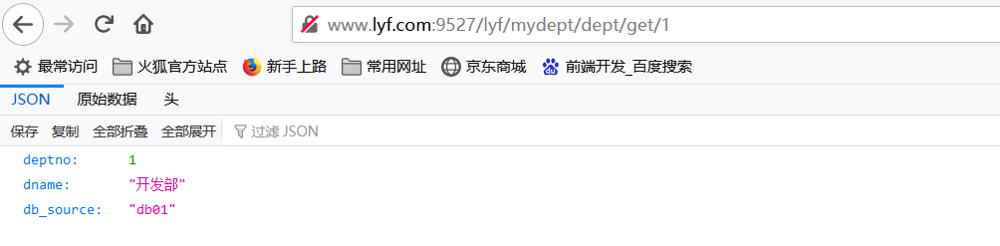

# Springcloud config

 spring Cloud Config为分布式系统中的外部配置提供服务器和客户端支持。使用Config Server，您可以在所有环境中管理应用程序的外部属性，为各个不同微服务应用提供一个中心化的外部配置。

springcloud config分为服务端和客户端两部分   


- springcloud config干嘛

  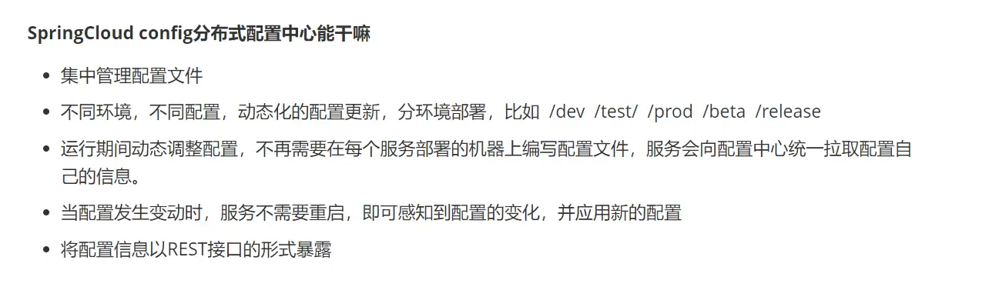

## Config 服务器端

1.建服务器端模块 导入依赖

```
<!-- config   -->
    <dependency>
        <groupId>org.springframework.cloud</groupId>
        <artifactId>spring-cloud-config-server</artifactId>
        <version>2.2.7.RELEASE</version>
    </dependency>

<!-- web要导入   -->
        <dependency>
        <groupId>org.springframework.boot</groupId>
        <artifactId>spring-boot-starter-web</artifactId>
    </dependency>
    
<!-- 有必要的话导入eureka -->
    <dependency>
        <groupId>org.springframework.cloud</groupId>
        <artifactId>spring-cloud-starter-eureka</artifactId>
        <version>1.4.7.RELEASE</version>
```

2.配置application.yml

```
server:
  port: 3344

spring:
  application:
    name: springcloud-config-server

  #链接远程仓库
  cloud:
    config:
      server:
        git:
          uri: https://github.com/kugga-no1/li-springcloud-config.git   #https
          username: kugga-no1
          password: fhnbyyb123
        lable: master   #读取的分支
```

3.启动类加注解

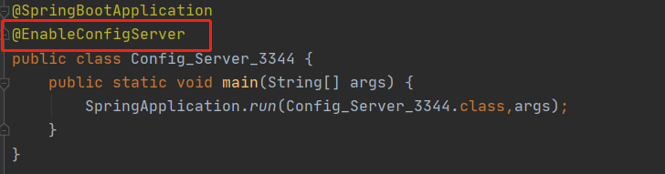

4.要读哪个配置就直接  /application_xxx.yml

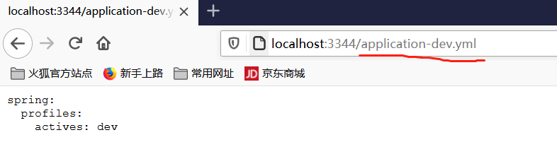

## config客户端

1.导入依赖

```
<!-- config客户端  -->
<dependency>
    <groupId>org.springframework.cloud</groupId>
    <artifactId>spring-cloud-starter-config</artifactId>
</dependency>
```

